# Lido V3 Staking Vaults - Formal Verification

1. [General information](#general-information)
2. [System overview](#system-overview)
3. [Lido spec](#lido-spec)
4. [Core specs](#core-specs)
5. [Miscellaneous specs](#miscellaneous-specs)
6. [Vaults](#vaults)
7. [Lazy oracle](#lazy-oracle)
8. [Predeposit guarantee](#predeposit-guarantee)
9. [Additional specs not in CI](#additional-specs-not-in-ci)

## General information

- Client repository: <https://github.com/lidofinance/core>
- Certora development branch is `certora-fv` (since `certora` was taken)
- CI Configuration: `.github/workflows/certora.yml`

## System overview

```mermaid
graph TB
  classDef utilityContract fill:#333,font-size:10pt;
  classDef SubGraph font-size:16pt,color:#aff;

  %% OracleReportSanityChecker utility class
  OracleReportSanityChecker(OracleReportSanityChecker)
  class OracleReportSanityChecker utilityContract

  subgraph CoreIn [Core in scope]
	  LidoLocator(LidoLocator)
	  NodeOperatorsRegistry
	  AccountingOracle --> Accounting
		Accounting --> OracleReportSanityChecker
	  Accounting --> Lido
	  Accounting --> Burner
  end

  subgraph CoreOut [Core]
	  WithdrawalQueue
	  StakingRouter
  end

	Accounting --> WithdrawalQueue
	Accounting --> StakingRouter

  subgraph StVaults [Staking Vaults]
    LazyOracle --> VaultHub
    VaultHub --> OperatorsGrid
    VaultHub --> StakingVault1
    VaultHub --> StakingVault2
  end

  AccountingOracle --> LazyOracle
  Accounting --> VaultHub
  OracleReportSanityChecker --> StakingRouter

	%% Invisible links to change position
	Lido ~~~ OracleReportSanityChecker

  %% Set sub graphs styles
  class CoreIn,CoreOut,StVaults SubGraph;
```



### Lido

- Lido is a staking pool
- To stake a user calls `submit` (or just transfers ETH),
  in return the user receives shares in `Lido` (equivalent to `StEth`).
  Note these are _internal shares_.
  Users of external `StakingVault`s can mint _external shares_.
- Uses a very old compiler version - 0.4.24

#### Lido staking limits

The _rate_ at which staking is done is limited. A description is available
in the documentation of `Lido.setStakingLimit`, see also
`StakeLimitUtils.calculateCurrentStakeLimit` (from `contracts/0.4.24/lib/StakeLimitUtils.sol`).

### VaultHub

The `VaultHub` connects the staking vaults to Lido protocol, allowing them to use their
balance to mint shares in Lido (and thereby use StEth). It is tasked with maintaining
the health of the staking vaults and ensuring their reserve ratios are kept.

### LazyOracle

This is the oracle for the staking vaults. It is "lazy" in the sense that it doesn't
actively update the `VaultHub` regarding all staking vaults. Instead updating a
staking vault's data requires a call to `updateVaultData`.

The `LazyOracle` quarantines some amounts reported for the staking vaults, if those
amount changes are deemed too large.

---

## Lido spec

- **File:** `certora/specs/lido/Lido.spec`
- **Config:** `certora/confs/lido/Base.conf` (and variants)
- **Status:** ✅ Verified in CI
- **Note:** Uses `--prover_version master` override in some configs

### Summaries

The spec summarizes functions that contain "muldiv" operations to avoid timeouts:

- `getSharesByPooledEth`
- `getPooledEthBySharesRoundUp`

### Lido main rules

1. **Invariant `bufferedEthBackedByBalance`** - the value of the buffered ETH (in the storage) is
   backed by the native ETH balance of the `Lido` contract.

2. **Rule `sharesTransition`** - a simple parametric rule verifying the relations between
   external shares, internal shares and the total shares.

3. **Invariant `prevLimitLessThanMax`** - the `prevStakeLimit` is the limit at a certain period
   in the past. It must never surpass the maximal stake limit, which is what this
   invariant verifies. See [Lido staking limits](#lido-staking-limits).

4. **Rule `prevStakingBlockNumberIncreasing`** - the block numbers for the previous stake
   limit should be weakly monotonically increasing.

5. **Rule `stakingLimitsUnchangedIfStaking`** - the maximal staking limit cannot change
   when someone is staking.

6. **Rule `stakingLimitsAreKept`** - a parametric rule stating various
   [staking limits](#lido-staking-limits) are kept.

   This rule is **violated** for `rebalanceExternalEtherToInternal()`, see
   [Issue 1320](https://github.com/lidofinance/core/issues/1320).

7. **Rule `totalSharesCanOnlyBeChangedBy`** - the functions that can increase or decrease
   the total amount of shares.

8. **Rule `bufferedEthCanOnlyBeChangedBy`** - the functions that can change the buffered
   ETH value.

9. **Rule `depositedValidatorsOnlyIncreasing`** - the number of deposited validators
   is weakly monotonic increasing.

---

## Core specs

These specs are mainly about the `Accounting` contract and therefore the handling of
the oracle report.

### Comprehensive setup spec

- **File:** `certora/specs/core/comprehensive-setup.spec`
- **Config:** `certora/confs/core/comprehensive-setup.conf`
- **Status:** ✅ Verified in CI

The rules here simply verify a couple of summaries.

### Main accounting spec

- **Files:**
  1. `certora/specs/core/Accounting.spec` - the main file containing the rules
  2. `certora/specs/core/Accounting-summarized.spec` - imports `Accounting.spec` and summarizes
     `OracleReportSanityChecker.smoothenTokenRebase`. The specs were constructed
     this way to facilitate different summaries.
- **Config:** `certora/confs/core/Accounting.conf`
- **Status:** ✅ Verified in CI (specific rules only)

#### Accounting main rules

1. **Rule `feesMintShares`** - shares minted as fees and balance increase do not exceed
   the rewards from the oracle report. Note that the spec `Accounting-fees-as-frac.spec`
   below complements this rule.
   - Run in CI with: `--rule handleOracleReportRevertConditions feesMintShares`

2. **Rule `handleOracleReportRevertConditions`** - revert conditions for
   `Accounting.handleOracleReport`.

The following two rules verify that specific actions performed between the time an
oracle report was calculated and the time it was handled, would not cause a revert.
Both rules **time-out** - it is unlikely this can be resolved.

- **Rule `reportNotRevertsByDeposit`**
- **Rule `reportNotRevertsBySubmit`**

### Accounting - fees as fraction spec

- **File:** `certora/specs/core/Accounting-fees-as-frac.spec`
- **Config:** `certora/confs/core/Accounting-fees-as-frac.conf`
- **Status:** ✅ Verified in CI

This spec was created for a single rule `feesAreFraction` which
verifies that when `Accounting.handleOracleReport` is called, the
fees minted as shares are the correct fraction of the rewards.
The rule simply checks the internal function
`Accounting._calculateTotalProtocolFeeShares`, since verifying
it using `Accounting.handleOracleReport` causes timeouts.

1. **Rule `feesAreFraction`** - is violated and acknowledged by Lido team, see [Issue 1457](https://github.com/lidofinance/core/issues/1457).
2. **Rule `feesAreTooLowExample`** - serves as a more realistic example that the fees may be
   too low.

### Accounting - shares burn limit

- **File:** `certora/specs/core/Accounting-burnlimit.spec`
- **Config:** `certora/confs/core/Accounting-burnlimit.conf`
- **Note:** This spec is not part of the CI

---

## Miscellaneous specs

### Burner spec

- **File:** `certora/specs/misc/burner.spec`
- **Config:** `certora/confs/misc/burner.conf`
- **Status:** ✅ Verified in CI

#### Burner main rules

The following rules prove that `Burner` shares can only be burnt, never transferred:

1. **Invariant `burnerDoesNotApprove`** - `Burner` contract never approves other
   addresses for using its shares.

2. **Rule `burnerSharesOnlyBurnt`** - Lido shares of `Burner` can only be reduced by burning.

Other rules:

1. **Rule `burnerDoesNotAffectThirdPartyShares`** - third parties should not be affected by the
   `Burner`.

   This rule is **violated**. See [Issue 1399](https://github.com/lidofinance/core/issues/1399)
   and its duplicate [Issue 796](https://github.com/lidofinance/core/issues/796).

2. **Rule `burnRequestsIntegrity`** - basic integrity of the five burn request methods.

3. **Rule `commitBurnIntergrity`** - basic integrity of `Burner.commitSharesToBurn` method.

### NodeOperatorsRegistry spec

- **File:** `certora/specs/misc/node_operators.spec`
- **Config:** `certora/confs/misc/node_operators.conf`
- **Status:** ✅ Verified in CI

1. This spec has a single rule **`operatorsCountIsIncreasing`** showing the number of
   operators is weakly monotonic increasing.
   - This rule requires the following munge to work: `certora/munges/munge-strategy-lib.patch`
     without it the call to `allocate` would havoc the main contract.

---

## Vaults

### Vaults array

- **File:** `certora/specs/vaults/vaults-array.spec`
- This file contains a setup for the `VaultHub` contract and some basic invariants about
  the array of vaults it contains. These invariants are used in `VaultHub.spec` by running `VaultHub.conf`.

The four invariants in this spec prove the following property: the `vaults` array of
addresses is a _set_ of addresses of connected vaults. Note that:

- The index of a vault `v` in the array is given by `connections[v].vaultIndex`.
- If the index of a vault is zero, it is not in the set.

1. **Invariant `disconnectedVaultIsNotPending`** - a staking vault that is pending disconnect
   is still connected, i.e. it has a non-zero index.
   - ✅ Verified in CI

2. **Invariant `vaultsArrayIsNeverEmpty`** - the array `vaults` has length greater than zero
   _after initialization_.
   - ✅ Verified in CI

3. **Invariant `indexToVaultIsCorrect`** - basically `connections[vaults[i]].vaultIndex == i`.

4. **Invariant `vaultToIndexIsCorrect`** - basically `vaults[connections[v].vaultIndex] == v`.
   - ✅ Verified in CI

### VaultHub spec

- **File:** `certora/specs/vaults/VaultHub.spec`
- **Config:** `certora/confs/vaults/VaultHub.conf`
- **Status:** ✅ Multiple rules verified in CI
- **Note:** Uses `--prover_version master` override

#### Invariants about vault connection and locked value

1. **Invariant `obligatedVaultIsConnected`** - a vault having Lido shares or unsettled Lido
   fees is connected.
   - ✅ Verified in CI

2. **Invariant `disconnectedVaultHasNoLiability`** - a disconnected vault cannot hold shares.
   - ✅ Verified in CI

3. **Invariant `disconnectedVaultHasNoLocked`** - a disconnected vault cannot have non-zero
   locked ETH.
   - ✅ Verified in CI

4. **Invariant `vaultLockedCoversLiabilityAndReserve`** - the locked amount of a vault
   covers its shares and reserve ratio. Used to be **violated**, see
   [Issue 1272](https://github.com/lidofinance/core/issues/1272) and
   [Issue 1309](https://github.com/lidofinance/core/issues/1309). Not in CI but manually verified and tested using fuzzing.

#### Rules for tiers and reserve ratios

**Note:** The tiers group vaults with same configuration. The tiers are managed by
the `OperatorGrid` contract.

1. **Invariant `tierReserveRatioLeqOne`** - every tier's reserve ratio is at most 1 (100%).
   - ✅ Verified in CI

2. **Invariant `reserveRatioNotBig`** - vault reserve ratios are bounded.
   - ✅ Verified in CI

3. **Invariant `tierReserveRatioGeThreshold`** - every tier's reserve ratio is at
   least that tier's force rebalance threshold. This invariant was previously **violated**,
   see [Issue 1291](https://github.com/lidofinance/core/issues/1291).
   - ✅ Verified in CI

4. **Invariant `vaultReserveRatioGeThreshold`** - similar to the invariant above,
   but for every vault.
   - ✅ Verified in CI

#### Liability and shares invariants

1. **Invariant `maxLiabilitySharesGeqLiabilityShares`** - max liability shares are always
   greater than or equal to current liability shares.
   - ✅ Verified in CI

2. **Invariant `redemptionSharesLeqLiabilityShares`** - redemption shares cannot exceed
   liability shares.
   - ✅ Verified in CI

#### Miscellaneous rules and invariants

1. **Invariant `pendingHasNoShares`** - a vault that is pending disconnect cannot have shares.
   This invariant is used in `canIncreaseTotalValue` rule.
   - ✅ Verified in CI

2. **Rule `canIncreaseTotalValue`** - functions that can increase a vault's total value.
   Previously this rule was **violated**, see
   [Issue 1298](https://github.com/lidofinance/core/issues/1298).
   - ✅ Verified in CI

3. **Rule `redemptionsIncrease`** - redemptions can only be increased by `applyVaultReport`.
   Previously **violated**, see [Issue 1321](https://github.com/lidofinance/core/issues/1321).
   - ✅ Verified in CI

#### Vault health rules

- **Spec File:** `certora/specs/vaults/VaultHub_health.spec`
- **Configs:**
  - `certora/confs/vaults/VaultHub_health_part1.conf`
  - `certora/confs/vaults/VaultHub_health_part2.conf`
  - `certora/confs/vaults/VaultHub_health_part3.conf`
- **Status:** ✅ Verified in CI (parts 1-3 only)

1. **Rule `vaultIsHealtyhUntilReport`** - only an oracle report can cause a vault to
   become unhealthy. Previously **violated**, see
   [Issue 1262](https://github.com/lidofinance/core/issues/1262).

   This rule is split across multiple configurations to handle different methods:
   - **Part 1:** Tests various connection and governance methods
   - **Part 2:** Tests `updateConnection`, `transferAndBurnShares`, `voluntaryDisconnect`, `triggerValidatorWithdrawals`
   - **Part 3:** Tests `forceValidatorExit`, `burnShares`

   **Note:** Additional parts 4-6 exist in the repository but are not included in CI:
   - Part 4: Tests `settleLidoFees`, `withdraw`, `mintShares`
   - Part 5: Tests `rebalance`, `burnShares`, `disconnect`, `forceRebalance`
   - Part 6: Tests `fund`

---

## Lazy oracle

- **File:** `certora/specs/vaults/lazy-oracle.spec`
- **Config:** `certora/confs/vaults/lazy-oracle.conf`
- **Status:** ✅ Verified in CI
- **Note:** Uses `--prover_version master` override

1. **Rule `quarantineIntegrity`** - basic integrity for quarantine of vault amounts.

2. **Invariant `startBeforeEnd`** - quarantine start time is before its end time.

3. **Rule `handleSanityChecksRevertConditions`** - revert conditions for `_handleSanityChecks`
   function (which verifies the oracle report).

4. **Rule `quarantineExpiry`** - an expired quarantine cannot be reused.

---

## Predeposit guarantee

- **File:** `certora/specs/vaults/predeposit.spec`
- **Config:** `certora/confs/vaults/predeposit.conf`
- **Status:** ✅ Verified in CI
- **Note:** Currently uses experimental prover version `abakst/cert-9655` (TODO: update to stable)

A basic spec with a single rule regarding the states of the pre-deposit.

---

## Additional specs not in CI

The following specifications exist in the repository but are not currently part of the CI pipeline:

### Immutable ratio spec

- **File:** `certora/specs/vaults/immutable-ratio.spec`
- **Config:** `certora/confs/vaults/immutable-ratio.conf`
- **Purpose:** Properties related to immutable conversion ratios

### Shortfall spec

- **File:** `certora/specs/vaults/shortfall.spec`
- **Config:** `certora/confs/vaults/shortfall.conf`
- **Purpose:** Advanced shortfall integrity rules

This spec contains detailed rules about health shortfall:

1. **Rule `unhealthyVaultIffShortfallNonzero`** - a vault is unhealthy if and only if its
   shortfall is non-zero. Previously failed,
   see [Issue 1305](https://github.com/lidofinance/core/issues/1305).

2. **Rule `nonZeroShortfallIsUnhealthy`** - a vault with non-zero health shortfall shares
   is unhealthy.

3. **Rule `shortfallValueIsSufficient`** - rebalancing to the amount of the shortfall makes
   a vault healthy. Previously **violated**, see
   [Issue 1305](https://github.com/lidofinance/core/issues/1305).

4. **Rule `shortfallValueIsMinimal`** - the health shortfall value is the minimal amount
   that will make a vault healthy by rebalancing. Previously **violated**, see
   [Issue 1305](https://github.com/lidofinance/core/issues/1305).

Note: These specs are not in CI due to timeout but were manually verified and tested using fuzzing.

### Approximated VaultHub spec

- **File:** `certora/specs/vaults/approximated-VaultHub.spec`
- **Config:** `certora/confs/vaults/approximated-VaultHub.conf`
- **Purpose:** Alternative verification approach with approximations

### Alternative Accounting configs

- **Config:** `certora/confs/core/Accounting-unsummarized.conf`
- **Purpose:** Accounting verification without certain function summaries

- **Config:** `certora/confs/core/Lido_and_VaultHub.conf`
- **Spec:** `certora/specs/core/Lido_and_VaultHub.spec`
- **Purpose:** Integration properties between Lido and VaultHub

### Sanity checks

Located in `certora/confs/setup/` and `certora/specs/setup/`:

- Sanity configurations for all major contracts (VaultHub, LazyOracle, StakingVault, etc.)
- Dispatching specs for testing function resolution

---

## Running the specs

To run all CI specs:

```bash
./certora/scripts/munge.sh
# Then run the configs listed in .github/workflows/certora.yml
```

To run a specific configuration:

```bash
certoraRun certora/confs/vaults/VaultHub.conf --rule <rule_name>
```

---


## Fuzzing Tests - Complementary Verification

For properties where formal verification times out, we use extensive Foundry fuzzing tests as complementary verification:

### VaultHub Health Invariant

- **File:** `test/0.8.25/vaults/vaulthub/VaultHubHealthInvariant.t.sol`
- **Property:** Healthy vault remains healthy until oracle report (excludes `settleLidoFees`)
- **Runs:** 20k invariant runs + 200k fuzz runs

### VaultHub Shortfall Calculation

- **File:** `test/0.8.25/vaults/vaulthub/VaultHubShortfallFuzz.t.sol`
- **Property:** Rebalancing by `healthShortfallShares()` makes vault healthy
- **Runs:** 1 million fuzz runs

### Locked Covers Liability and Reserve

- **File:** `test/0.8.25/vaults/vaulthub/VaultHubInvariantLockedCoversLiabilityAndReserve.t.sol`
- **Property:** `locked * (TOTAL_BP - reserveRatioBP) >= liabilityEth * TOTAL_BP`
- **Runs:** 10k invariant runs

**To run all fuzzing tests:**

```bash
forge test --match-path "test/0.8.25/vaults/vaulthub/VaultHub*" -vvv
```

---

## Notes

- Many configs use `--prover_version master` for stability
- The `certora/munges/` directory contains patches applied before verification
- Run `./certora/scripts/unmunge.sh` to revert patches after verification
