# Lido V3 Staking Vaults - Formal Verification

1. [General information](#general-information)
2. [System overview](#system-overview)
3. [Lido spec](#lido-spec)
4. [Core specs](#core-specs)
5. [Miscellaneous specs](#miscellaneous-specs)
6. [Vaults](#vaults)
7. [Lazy oracle](#lazy-oracle)
8. [Predeposit guarantee](#predeposit-guarantee)

## General information

- Client repository: https://github.com/lidofinance/core
- Certora repository: https://github.com/Certora/lido-staking-vaults
- Certora development branch is `certora-fv` (since `certora` was taken)
- Latest PR (still open) [PR #9](https://github.com/Certora/lido-staking-vaults/pull/9)

### Links

- [Notion main page](https://www.notion.so/certora/Lido-V3-stVaults-21cfe5c14fd380bebff6cfe683d60d11)
- [Formal verification properties - OUTDATED](https://www.notion.so/certora/Formal-Verification-Properties-21dfe5c14fd380f0bbb9c95999fd0489)

## Existing issues

1. [PredepositGuarantee](https://github.com/Certora/lido-staking-vaults/tree/shoham/merge-fixes2/contracts/0.8.25/vaults/predeposit_guarantee/PredepositGuarantee.sol)
   We have only a basic spec for this contract. One issue is the Jira ticket
   CERT-9553 (see below). Also this contract changed much due to vulnerabilities.

### Jira tickets

1. [CERT-9553](https://certora.atlassian.net/browse/CERT-9553) - this is an issue which
   prevented preparing a spec for the `PredepositGuarantee` contract.
   Restricting to `hashing_length_bound` of 48 (which is the length of
   the keys) still causes issues. I'm now using `hashing_length_bound` of 32,
   which is an under-approximation.
2. [CERT-9640](https://certora.atlassian.net/browse/CERT-9640) - prevents the main
   `Accounting` spec from running.
3. [CERT-9633](https://certora.atlassian.net/browse/CERT-9633) - caused problems for
   `LazyOracle` and was resolved by John. However similar problems remained for
   the `VaultHub` spec.
4. [CERT-9638](https://certora.atlassian.net/browse/CERT-9638) - inability to summarize
   or resolve certain calls. Causes issues for both `VaultHub` and `LazyOracle` spec.

## System overview

```mermaid
graph TB
  classDef utilityContract fill:#333,font-size:10pt;
  classDef SubGraph font-size:16pt,color:#aff;

  %% OracleReportSanityChecker utility class
  OracleReportSanityChecker(OracleReportSanityChecker)
  class OracleReportSanityChecker utilityContract

  subgraph CoreIn [Core in scope]
	  LidoLocator(LidoLocator)
	  NodeOperatorsRegistry
	  AccountingOracle --> Accounting
		Accounting --> OracleReportSanityChecker
	  Accounting --> Lido
	  Accounting --> Burner
  end

  subgraph CoreOut [Core]
	  WithdrawalQueue
	  StakingRouter
  end

	Accounting --> WithdrawalQueue
	Accounting --> StakingRouter

  subgraph StVaults [Staking Vaults]
    LazyOracle --> VaultHub
    VaultHub --> OperatorsGrid
    VaultHub --> StakingVault1
    VaultHub --> StakingVault2
  end

  AccountingOracle --> LazyOracle
  Accounting --> VaultHub
  OracleReportSanityChecker --> StakingRouter

	%% Invisible links to change position
	Lido ~~~ OracleReportSanityChecker

  %% Set sub graphs styles
  class CoreIn,CoreOut,StVaults SubGraph;
```

### Lido

- Lido is a staking pool
- To stake a user calls `submit` (or just transfers ETH),
  in return the user receives shares in `Lido` (equivalent to `StEth`).
  Note these are _internal shares_.
  Users of external `StakingVault`s can mint _external shares_.
- Uses a very old compiler version - 0.4.24

##### Lido staking limits

The _rate_ at which staking is done is limited. A description is available
in the documentation of `Lido.setStakingLimit`, see also
`StakeLimitUtils.calculateCurrentStakeLimit` (from `contracts/0.4.24/lib/StakeLimitUtils.sol`).

### VaultHub

The `VaultHub` connects the staking vaults to Lido protocol, allowing them to use their
balance to mint shares in Lido (and thereby use StEth). It is tasked with maintaining
the health of the staking vaults and ensuring their reserve ratios are kept.

### LazyOracle

This is the oracle for the staking vaults. It is "lazy" in the sense that it doesn't
actively update the `VaultHub` regarding all staking vaults. Instead updating a
staking vault's data requires a call to `updateVaultData`.

The `LazyOracle` quarantines some amounts reported for the staking vaults, if those
amount changes are deemed too large.

---

## Lido spec

- [File: Lido.spec](https://github.com/Certora/lido-staking-vaults/tree/shoham/merge-fixes2/certora/specs/lido/Lido.spec)
- [Latest run - including fixes2](https://prover.certora.com/output/98279/d30ef4f87cfc4aa09f2a587f69fd6911).
- **Important.** This run used `--prover_version master` override.
- **Status ok** :white_check_mark:

### Summaries

I've tried to summarize functions that contain "muldiv" operations, such as:

- `getSharesByPooledEth`
- `getPooledEthBySharesRoundUp`

### Main rules

1. Invariant `bufferedEthBackedByBalance` - the value of the buffered ETH (in the storage) is
   backed by the native ETH balance of the `Lido` contract.
2. Rule `sharesTransition` - a simple parametric rule verifying the relations between
   external shares, internal shares and the total shares.
3. Invariant `prevLimitLessThanMax` - the `prevStakeLimit` is the limit at a certain period
   in the past. It must never surpass the maximal stake limit, which is what this
   invariant verifies. See [Lido staking limits](#lido-staking-limits).
4. Rule `prevStakingBlockNumberIncreasing` - the block numbers for the previous stake
   limit should be weakly monotonically increasing.
5. Rule `stakingLimitsUnchangedIfStaking` - the maximal staking limit cannot change
   when someone is staking.
6. Rule `stakingLimitsAreKept` - a parametric rule stating various
   [staking limits](#lido-staking-limits) are kept.

   This rule is **violated** for `rebalanceExternalEtherToInternal()`, see
   [Issue 1320](https://github.com/lidofinance/core/issues/1320).

7. Rule `totalSharesCanOnlyBeChangedBy` - the functions that can increase or decrease
   the total amount of shares.
8. Rule `bufferedEthCanOnlyBeChangedBy` - the functions that can change the buffered
   ETH value.
9. Rule `depositedValidatorsOnlyIncreasing` - the number of deposited validators
   is weakly monotonic increasing.

---

## Core specs

These specs are mainly about the `Accounting` contract and therefore the handling of
the oracle report.

### Comprehensive setup spec

- [File: comprehensive-setup.spec](https://github.com/Certora/lido-staking-vaults/tree/shoham/merge-fixes2/certora/specs/core/comprehensive-setup.spec)
- [Latest run - including fixes2](https://prover.certora.com/output/1000000000/687aefe3063e4822beb33fc217ca9014/?anonymousKey=d6bd900fcedc485a1b4a0b0e9a8182e22d502f44)
- **Status ok** :white_check_mark:
  The rules here simply verify a couple of summaries.

### Main accounting spec

- Files:
  1. [Accounting.spec](https://github.com/Certora/lido-staking-vaults/tree/shoham/merge-fixes2/certora/specs/core/Accounting.spec)
     the main file containing the rules.
  2. [Accounting-summarized.spec](https://github.com/Certora/lido-staking-vaults/tree/shoham/merge-fixes2/certora/specs/core/Accounting-summarized.spec)
     this mainly just imports `Accounting.spec` and summarizes
     `OracleReportSanityChecker.smoothenTokenRebase`. The specs were constructed
     this was to facilitate different summaries.
- [Latest run - including fixes2](https://prover.certora.com/output/98279/922913e55e694aa5837f2d6bff524e3c)
- **Status ERROR** :X:
  - This run has a problem reported in [CERT-9640](https://certora.atlassian.net/browse/CERT-9640).

#### Main rules

1. Rule `feesMintShares` - shares minted as fees and balance increase do not exceed
   the rewards from the oracle report. Note that the spec `Accounting-fees-as-frac.spec`
   below complements this rule.
2. Rule `handleOracleReportRevertConditions` - revert conditions for
   `Accounting.handleOracleReport`.

The following two rules verify that specific actions performed between the time an
oracle report was calculated and the time it was handled, would not cause a revert.
Both rules **time-out** - it is unlikely this can be resolved.

1. Rule `reportNotRevertsByDeposit`.
2. Rule `reportNotRevertsBySubmit`.

### Accounting - fees as fraction spec

- [File: Accounting-fees-as-frac.spec](https://github.com/Certora/lido-staking-vaults/tree/shoham/merge-fixes2/certora/specs/core/Accounting-fees-as-frac.spec)
- [Latest run - including fixes2](https://prover.certora.com/output/1000000000/379a04486ed84257bafba89eb86d5909/?anonymousKey=da0eb2cfe20bdc688ce0578da257a6f6bdcef556)
- **Status ok** :white_check_mark:

This spec was created for a single rule `feesAreFraction` which
verifies that when `Accounting.handleOracleReport` is called, the
fees minted as shares are the correct fraction of the rewards.
The rule simply check the internal function
`Accounting._calculateTotalProtocolFeeShares`, since verifying
it using `Accounting.handleOracleReport` cause timeouts.

1. Rule `feesAreFraction` - is **violated**, see [Issue 1457](https://github.com/lidofinance/core/issues/1457).
2. Rule`feesAreTooLowExample` serves as a more realistic example that the fees may be
   too low.

### Accounting - shares burn limit

- [File: Accounting-burnlimit.spec](https://github.com/Certora/lido-staking-vaults/tree/shoham/merge-fixes2/certora/specs/core/Accounting-burnlimit.spec)
- **Note.** This spec is not part of the CI, since I am not sure it is correct.

---

## Miscellaneous specs

### Burner spec

- [File: burner.spec](https://github.com/Certora/lido-staking-vaults/tree/shoham/merge-fixes2/certora/specs/misc/burner.spec)
- [Latest run - including fixes2](https://prover.certora.com/output/1000000000/4d00dd153ec74143a65d94b7df77900c/?anonymousKey=66c977e8a74d6c1554d7c6f47b6f652ce6dc296f)
- **Status ok** :white_check_mark:

#### Main rules

The following rules prove that `Burner` shares can only be burnt, never transferred:

1. Invariant `burnerDoesNotApprove` - `Burner` contract does never approves other
   addresses for using its shares.
2. Rule `burnerSharesOnlyBurnt` - Lido shares of `Burner` can only be reduced by burning.

Other rules:

1. Rule `burnerDoesNotAffectThirdPartyShares` - third parties should not be affected by the
   `Burner`.

   This rule is **violated**. See [Issue 1399](https://github.com/lidofinance/core/issues/1399)
   and its duplicate [Issue 796](https://github.com/lidofinance/core/issues/796).

2. Rule `burnRequestsIntegrity` - basic integrity of the five burn request methods.
3. Rule `commitBurnIntergrity` - basic integrity of `Burner.commitSharesToBurn` method.

### NodeOperatorsRegistry spec

- [File: node_operators.spec](https://github.com/Certora/lido-staking-vaults/tree/shoham/merge-fixes2/certora/specs/misc/node_operators.spec)
- [Latest run - including fixes2](https://prover.certora.com/output/98279/e53ddc5c71004ee6af93f0d46e40abb1)
- **Status ok** :white_check_mark:

1. This spec has a single rule `operatorsCountIsIncreasing` showing the number of
   operators is weakly monotonic increasing.
   - This rule requires the following munge to work:
     [munge-strategy-lib.patch](https://github.com/Certora/lido-staking-vaults/tree/shoham/merge-fixes2/certora/munges/munge-strategy-lib.patch),
     without it the call to `allocate` would havoc the main contract.

---

## Vaults

### Vaults array

- [File: vaults-array.spec](https://github.com/Certora/lido-staking-vaults/tree/shoham/merge-fixes2/certora/specs/vaults/vaults-array.spec)
- This file contains a setup for the `VaultHub` contract and some basic invariants about
  the array of vaults it contains. These invariants are used in
  [VaultHub.spec](https://github.com/Certora/lido-staking-vaults/tree/shoham/merge-fixes2/certora/specs/vaults/VaultHub.spec)
  (by running [VaultHub.conf](https://github.com/Certora/lido-staking-vaults/tree/shoham/merge-fixes2/certora/confs/vaults/VaultHub.conf)).

The four invariants in this spec prove the following property: the `vaults` array of
addresses is a _set_ of addresses of connected vaults. Note that:

- The index of a vault `v` in the array is given by `connections[v].vaultIndex`.
- If the index of a vault is zero, it is not in the set.

1. Invariant `disconnectedVaultIsNotPending` - a staking vault that is pending disconnect
   is still connected, i.e. it has a non-zero index.
2. Invariant `vaultsArrayIsNeverEmpty` - the array `vaults` has length greater than zero
   _after initialization_.
3. Invariant `indexToVaultIsCorrect` - basically `connections[vaults[i]].vaultIndex == i`.
4. Invariant `vaultToIndexIsCorrect` - basically `vaults[connections[v].vaultIndex] == v`.

### VaultHub

- [File: VaultHub.spec](https://github.com/Certora/lido-staking-vaults/tree/shoham/merge-fixes2/certora/specs/vaults/VaultHub.spec)
- [Latest run - including fixes2](https://prover.certora.com/output/98279/e39c5e73fdc04af2a6c5d0f5904f5612)
- **Important.** This run used `--prover_version master` override.
- **Status ERROR** :X:
  - This run suffers from reported issue
    [CERT-9638](https://certora.atlassian.net/browse/CERT-9638) - inability to summarize.

#### Invariants about vault connection and locked value

1. Invariant `obligatedVaultIsConnected` - a vault having Lido shares or unsettled Lido
   fees is connected.
2. Invariant `disconnectedVaultHasNoLiability` - a disconnected vault cannot hold shares.
3. Invariant `disconnectedVaultHasNoLocked` - a disconnected vault cannot have non-zero
   locked ETH.
4. Invariant `vaultLockedCoversLiabilityAndReserve` - the locked amount of a vault
   covers its shares and reserve ration. Used to be **violated**, see
   [Issue 1272](https://github.com/lidofinance/core/issues/1272) and
   [Issue 1309](https://github.com/lidofinance/core/issues/1309).

#### Rules for tiers

**Note.** The tiers groups of vaults with same configuration. The tiers are managed by
the `OperatorGrid` contract.

1. Invariant `reserveRatioNotGreaterThanThreshold` - every tier's reserve ratio is at
   least that tier's force rebalance threshold. This invariant was previously **violated**,
   see [Issue 1291](https://github.com/lidofinance/core/issues/1291).
2. Invariant `vaultReserveRatioNotGreaterThanThreshold` - similar to the invariant above,
   but for every vault.

#### Miscellaneous rules and invariants

1. Invariant `pendingHasNoShares` - a vault that is pending disconnect cannot have shares.
   This invariant is used in `canIncreaseTotalValue` rule.
2. Rule `canIncreaseTotalValue` - functions that can increase a vault's total value.
   Previously this rule was **violated**, see
   [Issue 1298](https://github.com/lidofinance/core/issues/1298).
3. Rule `redemptionsIncrease` - fees can only be increased by `applyVaultReport`.
   Previously **violated**, see [Issue 1321](https://github.com/lidofinance/core/issues/1321).

#### Vault health rules

1. Rule `vaultIsHealtyhUntilReport` - only an oracle report can cause a vault to
   become unhealthy. Previously **violated**, see
   [Issue 1262](https://github.com/lidofinance/core/issues/1262).

#### Integrity of shortfall

1. Rule `unhealthyVaultIffShortfallNonzero` - a vault is unhealthy if and only if its
   shortfall is non-zero. Previously failed,
   see [Issue 1305](https://github.com/lidofinance/core/issues/1305).
2. Rule `nonZeroShortfallIsUnhealthy` - a vault with non-zero health shortfall shares
   is unhealthy.
3. Rule `shortfallValueIsSufficient` - rebalancing to the amount of the shortfall makes
   a vault healthy. Previously **violated**, see
   [Issue 1305](https://github.com/lidofinance/core/issues/1305).
4. Rule `shortfallValueIsMinimal` - the health shortfall value is the minimal amount
   that will make a vault healthy by rebalancing. Previously **violated**, see
   [Issue 1305](https://github.com/lidofinance/core/issues/1305).

---

## Lazy oracle

- [File: lazy-oracle.spec](https://github.com/Certora/lido-staking-vaults/tree/shoham/merge-fixes2/certora/specs/vaults/lazy-oracle.spec)
- [Latest run - including fixes2](https://prover.certora.com/output/98279/ddc71b9b85af473cabfe300669100801/)
- **Important.** This run used `--prover_version master` override due to
  [CERT-9633](https://certora.atlassian.net/browse/CERT-9633).
- **Status ERROR** :X:
  - This run suffers from reported issue
    [CERT-9638](https://certora.atlassian.net/browse/CERT-9638) - inability to summarize,
    which causes violations.

1. Rule `quarantineIntegrity` - basic integrity for quarantine of vault amounts.
2. Invariant `startBeforeEnd` - quarantine start time is before its end time.
3. Rule `handleSanityChecksRevertConditions` - revert conditions for `_handleSanityChecks`
   function (which verifies the oracle report).
4. Rule `quarantineExpiry` - an expired quarantine cannot be reused.

---

## Predeposit guarantee

- [File: predeposit.spec](https://github.com/Certora/lido-staking-vaults/tree/shoham/merge-fixes2/certora/specs/vaults/predeposit.spec)
- [Latest run - including fixes2](https://prover.certora.com/output/98279/e05c1eb9d0734d3fa1d58ef636bcd0b9)
- **Status ERROR** :X:
  - There is one weird sanity issue here, see
    https://certora.slack.com/archives/CTU8BQ3JQ/p1760279830210769
    for a munge that solves it
- A very basic spec with a single rule regarding the states of the pre-deposit.
