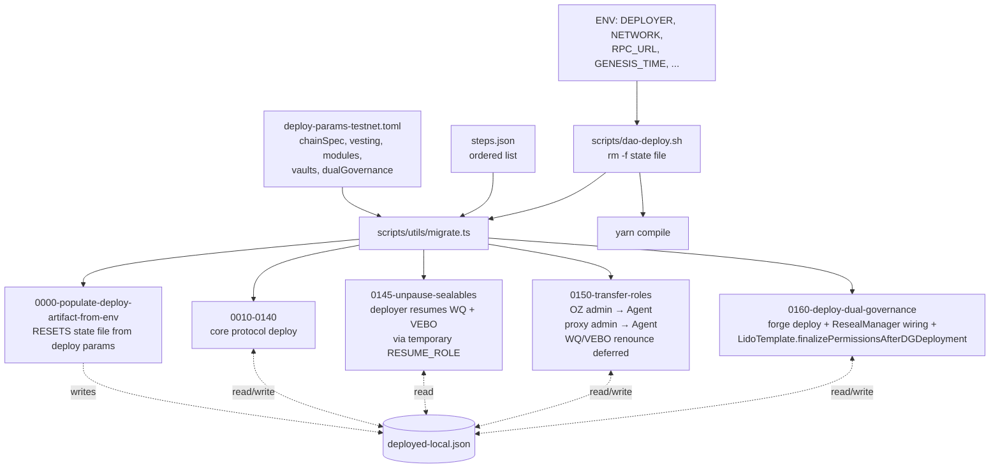
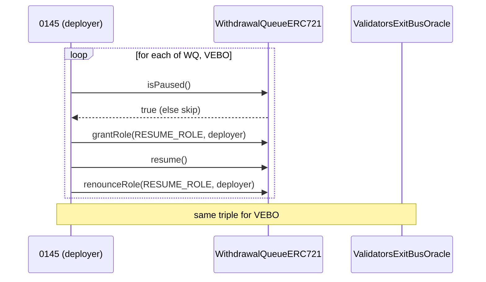
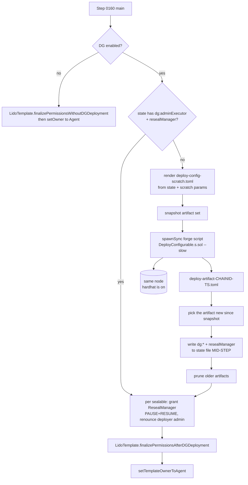
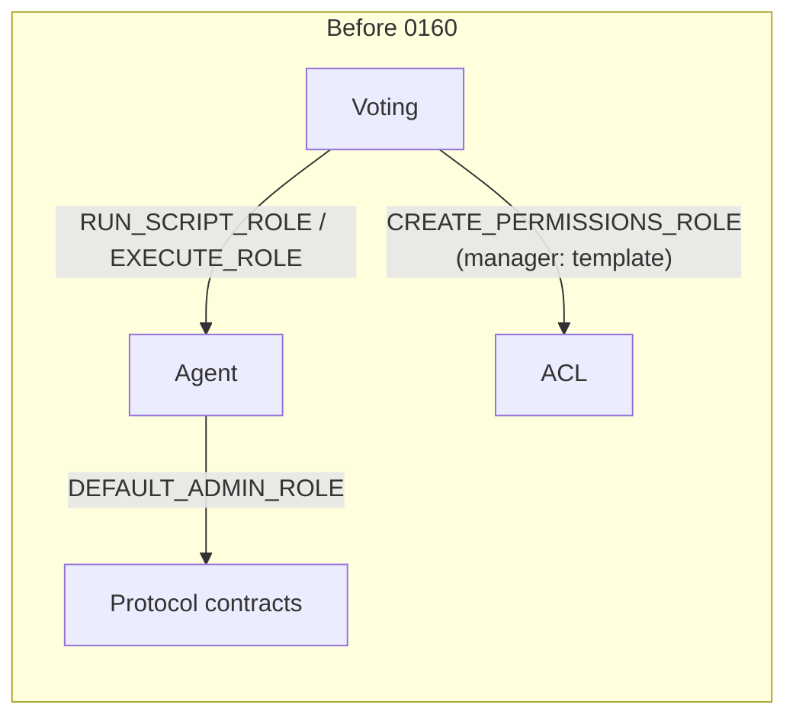
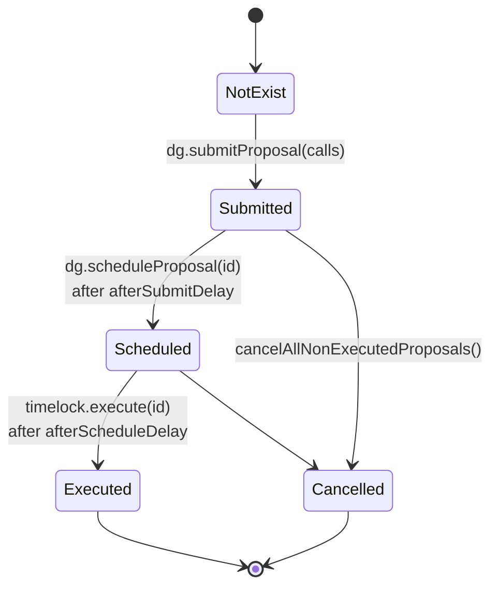
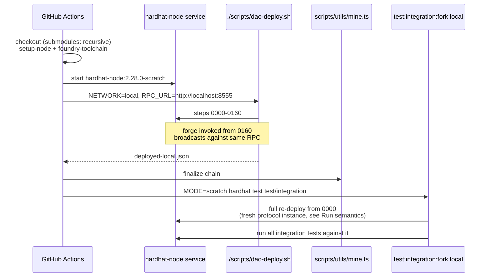

# Scratch Deploy Architecture

How the scratch deploy works under the hood and why it is built that way:
what moves between the pieces, how Dual Governance (DG) is wired in, and
which invariants the pipeline maintains. For _running_ a scratch deploy
(commands, environments, configuration knobs), see the operator handbook:
[scratch-deploy.md](./scratch-deploy.md). Step mechanics are documented here
and only summarized there — when steps change, update this file and check the
handbook's summaries still hold.

## Vocabulary

- **Scratch deploy** — runs every step in `scripts/scratch/steps.json` against a
  blank chain (local hardhat-node, anvil, or a fresh testnet) and records
  progress in a `deployed-<network>.json` file.
- **Step** — a `.ts` file under `scripts/scratch/steps/` with an
  `export async function main()`. Steps run in numeric-prefix order.
- **Network state file** — `deployed-<network>.json`. Each step reads from and
  appends to it. Acts as the bus between steps.
- **Aragon Voting / Agent** — DAO components from the Aragon stack:
  - **Voting** is the proposer-of-record for governance actions.
  - **Agent** holds protocol-level admin roles (`DEFAULT_ADMIN_ROLE` on
    OZ-AccessControl contracts, ACL permission grants, etc).
- **Dual Governance (DG)** — Lido's two-tier governance with a veto-signalling
  escrow and an emergency-protected timelock. See `foundry/lib/dual-governance`
  (vendored as a submodule, pinned to `v1.0.2`).
- **AdminExecutor** — the executor contract DG uses to call out to Agent.
  After launch, DG drives Agent through it.
- **ResealManager** — DG component that can pause/resume sealable contracts
  (Withdrawal Queue, Validators Exit Bus Oracle).
- **LidoTemplate** — the Aragon DAO factory/configurator contract. Owns the
  DAO's permission bootstrap; the DG launch is one of its finalize paths.

## High-level flow



There is no separate "launch DG" step: `0160` both deploys the DG contracts
(via forge) and performs the governance hand-off on-chain through
`LidoTemplate.finalizePermissionsAfterDGDeployment(adminExecutor)`. Because
the hand-off is a regular owner call on the template — not an impersonated
Voting/Agent script — the same pipeline works on live networks, not just on
forks with `*_impersonateAccount` available.

## Step inventory

```mermaid
flowchart LR
    subgraph Phase1[Phase 1: Bootstrap]
        S0000[0000<br/>populate from env]
        S0010[0010<br/>deposit contract]
    end

    subgraph Phase2[Phase 2: Aragon]
        S0020[0020<br/>aragon env]
        S0030[0030<br/>template + bases]
        S0040[0040<br/>ENS]
        S0050[0050<br/>APM]
        S0060[0060<br/>app repos]
        S0070[0070<br/>DAO]
        S0080[0080<br/>tokens]
    end

    subgraph Phase3[Phase 3: Protocol]
        S0083[0083<br/>core]
        S0085[0085<br/>vaults]
        S0090[0090<br/>locator]
        S0100[0100<br/>gate seal]
        S0110[0110<br/>finalize DAO]
        S0120[0120<br/>locator inits]
        S0130[0130<br/>roles grant]
        S0140[0140<br/>staking modules]
    end

    subgraph Phase4[Phase 4: Hand-off + Dual Governance]
        S0145[0145<br/>unpause sealables]
        S0150[0150<br/>roles transfer]
        S0160[0160<br/>deploy + launch DG]
    end

    Phase1 --> Phase2 --> Phase3 --> Phase4
```



Phase 4 is the DG-aware part. Earlier phases are out of scope here; see
`scripts/scratch/steps/` for their bodies.

## State file as the bus

Every step talks to the next via `deployed-<network>.json`. There is no
in-memory hand-off between steps because each step runs in isolation through
`scripts/utils/migrate.ts` (or `lib/scratch.ts:applySteps` in tests).

```mermaid
flowchart LR
    direction LR
    StateFile[(deployed-local.json)]

    subgraph Readers
        direction TB
        R0010[0010 reads chainSpec]
        R0145[0145 reads WQ, VEBO]
        R0150[0150 reads<br/>app:agent, app:voting, proxies]
        R0160[0160 reads<br/>app:lido, wstETH, WQ, VEBO,<br/>voting, lidoTemplate, aragonAcl]
    end

    subgraph Writers
        direction TB
        W0000[0000 RESETS file, writes<br/>chainSpec, deployer]
        W0083[0083 writes<br/>app:lido, accounting, burner, ...]
        W0160[0160 writes<br/>dg:* + resealManager<br/>mid-step, right after forge]
    end

    Readers -.read.-> StateFile
    StateFile <-.write.- Writers
```

Access patterns:

- `getAddress(Sk.x, state)` — throws if missing. Used when the step expects the
  entry to exist (e.g. core protocol pieces).
- `tryGetAddress(Sk.x, state)` — returns `undefined`. Used by the resume guard
  in 0160 to detect "forge already ran."

DG single-address entries use the shape `{ address: "0x…" }` (not
`{ proxy: { address } }`) because none of the upstream DG contracts are
proxies. The exception is `dg:tiebreakerSubCommittees`, which holds an array
under `{ addresses: [...] }` (one entry per committee).

## Run semantics: always a single clean pass

The pipeline assumes a fresh start every time; there is no incremental or
resume-from-state mode:

- `scripts/dao-deploy.sh` does `rm -f "$NETWORK_STATE_FILE"` before running
  the steps.
- Step `0000` calls `resetStateFileFromDeployParams()`, which unconditionally
  rewrites the state file from `deploy-params-testnet.toml` — even if the
  `rm -f` was skipped, nothing deployed earlier survives into the new pass.
- `lib/scratch.ts:applySteps` dedups steps only in-memory (per process), not
  against the state file.

Two consequences worth knowing:

1. **The integration suite re-deploys everything.** `MODE=scratch` test runs
   (`yarn test:integration:fork:local`) call `deployScratchProtocol()` inside
   the test process, which runs all steps from `0000` — resetting the state
   file and deploying a **second, fresh protocol instance** on the same chain
   (including a second forge DG deploy). The suite then tests that second
   instance; the first deploy's contracts are simply abandoned. This is fine
   on a disposable fork and is exactly what CI does, but it means the suite
   validates "scratch deploy works on this chain", **not** the artifacts of a
   previous deploy. Don't point `NETWORK_STATE_FILE` at a state file you want
   to keep — step `0000` will overwrite it.
2. **The idempotency guards in 0145/0150/0160 are not a resume mode.** A full
   re-run always goes through the `0000` reset, so the guards never see prior
   state in that flow. They exist for the one genuinely dangerous partial
   failure: `0160` persists the forge output to the state file _mid-step_
   (right after `forge script` exits, before the permission hand-off). If the
   step dies after that persist — finalize reverted, RPC dropped — re-running
   **just step 0160** (e.g. via a custom `STEPS_FILE` subset) resumes cleanly:
   - `tryGetAddress(dg:adminExecutor)` → skip the expensive forge deploy,
     reuse the recorded addresses;
   - `hasRole(DEFAULT_ADMIN_ROLE, deployer)` per sealable → skip ResealManager
     wiring already done (the renounce makes each iteration self-erasing);
   - `acl.hasPermission(AE, agent, RUN_SCRIPT_ROLE)` → skip the template
     finalize if it already executed (it is not re-callable: the template
     wipes its deploy state);
   - `owner == Agent` → skip `setOwner`, and in the no-DG path also skip
     finalize (ownership transfer is ordered after finalize, so Agent-as-owner
     implies finalize already ran).

## Phase 4 in detail

### Step 0145: unpause sealables

DG's `addSealableWithdrawalBlocker` rejects paused contracts. Withdrawal Queue
and Validators Exit Bus Oracle ship paused on a fresh deploy (mainnet's WQ had
been resumed for years by the time DG launched there). Step 0145 runs **before**
the role transfer in 0150, while the deployer still holds `DEFAULT_ADMIN_ROLE`
on both contracts: it grants itself `RESUME_ROLE`, resumes, and renounces the
role. No impersonation — works on a live network.

When DG is disabled (`DG_DEPLOYMENT_ENABLED=false`), 0145 is a no-op and both
contracts stay paused, matching the historical pre-DG scratch state.



### Step 0150: transfer roles, defer two renounces

0150 hands protocol admin from the deployer to Agent: grants Agent
`DEFAULT_ADMIN_ROLE` on every OZ-AccessControl contract, changes every
`OssifiableProxy` admin to Agent, transfers the `DepositSecurityModule` owner,
and moves the `WithdrawalsManagerProxy` admin to Voting.

Two deviations when DG is enabled:

- **Deferred renounce on WQ + VEBO.** The deployer _keeps_ its
  `DEFAULT_ADMIN_ROLE` on the two sealables (`deferDgRenounce: true` in the
  transfer table). Step 0160 still needs it to grant ResealManager
  `PAUSE_ROLE`/`RESUME_ROLE`; it renounces immediately after wiring. Agent
  already received its admin grant in 0150 either way, so the end state is
  identical — only the deployer's exit is delayed by one step.
- **Template ownership stays with the deployer.** `LidoTemplate`'s finalize
  functions are `onlyOwner`; 0160 calls one of them, then hands the template
  to Agent itself.

### Step 0160: deploy DG via forge, launch via LidoTemplate

Lido core is a hardhat project. DG is a foundry project — it ships its own
`scripts/deploy/DeployConfigurable.s.sol`, which expects a TOML config in
`<dg>/deploy-config/`. Step 0160 bridges them, then performs the governance
hand-off:



Implementation notes, in pipeline order:

- **Config render** (`renderDGConfigToml`): pulls stETH/wstETH/WQ/VEBO/Voting
  addresses from state, sets Voting as both `admin_proposer` and
  `proposals_canceller`, registers WQ + VEBO as sealable withdrawal blockers,
  and copies timings/committees from the `[dualGovernance]` section of the
  scratch params. The emergency-protection end date is anchored on the current
  **block** timestamp, not the wall clock — anvil forks can be hours behind
  real time. Rage-quit support values are emitted through native `bigint`
  (ethers patches `BigInt.prototype.toJSON`, which breaks `@iarna/toml`'s type
  detection; the step temporarily removes the patch during stringify).
- **Dev-address tripwire**: on any chain id other than 31337/1337 the step
  warns if committee/proposer params still contain anvil's well-known dev
  accounts — a guard against copy-pasting the testnet defaults into a real
  deploy (the keys are public; whoever holds them controls the committees).
- **Forge invocation**: `--broadcast --slow` against the URL of the hardhat
  network in use (`network.config.url`, falling back to `RPC_URL` for
  networks without one), so DG lands on the same chain as everything else
  even when a dotenv-loaded `RPC_URL` points elsewhere — in CI's integration
  phase `.env` carries the public-provider default while `--network local`
  targets the service container. `--slow` serializes broadcasts — forge can
  otherwise pipeline receipts faster than a fork-backed anvil fetching cold
  upstream slots can respond. Signing reuses hardhat's account for the
  network (`--private-key` from `accounts.json`) and falls back to
  `--unlocked --sender <deployer>` on dev nodes.
- **Artifact pick**: DG's deploy script writes
  `deploy-artifact-<chainId>-<blockTs>.toml`. The step snapshots the artifact
  directory before forge and picks the file that is new afterwards — no
  reliance on file mtime or wall clock. Older artifacts are pruned (the DG
  submodule does not gitignore them; without cleanup every deploy pollutes
  `git status` of the parent repo).
- **ResealManager wiring**: for each sealable, grant `PAUSE_ROLE` +
  `RESUME_ROLE` to ResealManager, then renounce the deployer's (deferred)
  `DEFAULT_ADMIN_ROLE` — the grant deferred in 0150 ends here.
- **The launch itself** is one template call,
  `finalizePermissionsAfterDGDeployment(adminExecutor)`
  (`contracts/0.4.24/template/LidoTemplate.sol`):

  - grants AdminExecutor `RUN_SCRIPT_ROLE` + `EXECUTE_ROLE` on Agent;
  - revokes both from Voting;
  - sets Agent as permission manager for those two roles;
  - migrates ACL `CREATE_PERMISSIONS_ROLE` from the template to Agent
    (grant + manager), removing Voting from permission creation.

  This mirrors what mainnet's DG launch omnibus did via the Aragon vote
  ceremony; on scratch the template still owns the bootstrap permissions, so
  it can perform the same topology change directly — no impersonation, no
  launch proposal. Items 1–27 of the mainnet omnibus are no-ops here because
  `LidoTemplate` already creates Lido/NOR/SDVT/Kernel/EVMScriptRegistry
  permissions with Agent as grantee and manager.

- **Ownership hand-off**: `setTemplateOwnerToAgent` — shared by the DG and
  no-DG paths, no-op once Agent owns the template.

With DG disabled, the same step calls
`finalizePermissionsWithoutDGDeployment()` instead, which performs the same
permission-manager finalization but keeps **Voting** as the manager (the
pre-DG topology), then hands the template to Agent.

## Governance topology: before vs after




Voting still exists and is still the admin proposer (and canceller) for DG,
but it can no longer call Agent directly. Every protocol-modifying action now
goes through the timelock; the veto-signalling escrow can stop a malicious
proposal between submission and execution. ResealManager holds
`PAUSE_ROLE`/`RESUME_ROLE` on both sealables.

`test/integration/dual-governance/dg-scratch.integration.ts` asserts exactly
this end state — addresses populated, DG registered as timelock governance,
zero launch proposals, the role moves above, and an end-to-end no-op proposal
routed Voting → DG → AdminExecutor → Agent.

## Proposal lifecycle (timelock)

The DG `EmergencyProtectedTimelock` enforces this state machine on every
proposal:



The scratch deploy itself submits **no** proposals — the launch is done by the
template call above, and the timelock starts empty. The lifecycle machinery is
exercised by `scripts/utils/upgrade.ts:executeDGProposal`, which walks an
already-submitted proposal through schedule and execute, advancing chain time
across both delays. Its users:

- the DG scratch integration test (end-to-end no-op proposal,
  `retryOnTimeConstraint: false` — scratch params set no execution windows);
- upgrade-on-fork tooling (`mockDGAragonVoting`, with
  `retryOnTimeConstraint: true` to step past mainnet `TimeConstraints`).

## CI flow

`.github/workflows/tests-integration-scratch.yml` runs two jobs against a
`hardhat-node:2.28.0-scratch` service container — **Scratch with DG** and
**Scratch without DG** (`DG_DEPLOYMENT_ENABLED=false`):



The submodule checkout matters: 0160 shells out to `forge` inside
`foundry/lib/dual-governance`, so CI needs both the Foundry toolchain and a
recursively-initialized submodule.

## Files of interest

| File                                                         | Role                                                           |
| ------------------------------------------------------------ | -------------------------------------------------------------- |
| `scripts/dao-deploy.sh`                                      | Entry point; wipes state file, compiles, runs `migrate.ts`     |
| `scripts/utils/migrate.ts`                                   | Iterates `steps.json`, imports each step, calls `main()`       |
| `lib/scratch.ts`                                             | `applySteps`, `deployScratchProtocol`, `isDGDeploymentEnabled` |
| `scripts/scratch/steps.json`                                 | Ordered list of step paths (ends at 0160)                      |
| `scripts/scratch/deploy-params-testnet.toml`                 | All deploy parameters (`[dualGovernance]` at the bottom)       |
| `scripts/scratch/steps/0145-unpause-sealables.ts`            | DG prerequisite: resume WQ + VEBO pre-role-transfer            |
| `scripts/scratch/steps/0150-transfer-roles.ts`               | Admin hand-off to Agent; defers WQ/VEBO renounce for DG        |
| `scripts/scratch/steps/0160-deploy-dual-governance.ts`       | Forge bridge + ResealManager wiring + template finalize        |
| `contracts/0.4.24/template/LidoTemplate.sol`                 | `finalizePermissions{After,Without}DGDeployment`, `setOwner`   |
| `scripts/utils/upgrade.ts`                                   | Shared `executeDGProposal` helper                              |
| `lib/state-file.ts`                                          | `Sk` enum, `getAddress`, `tryGetAddress`, state reset/persist  |
| `lib/config-schemas.ts`                                      | Zod schema for `[dualGovernance]`                              |
| `foundry/lib/dual-governance/`                               | DG submodule (pinned to v1.0.2)                                |
| `test/integration/dual-governance/dg-scratch.integration.ts` | Post-launch topology assertions + e2e proposal                 |
