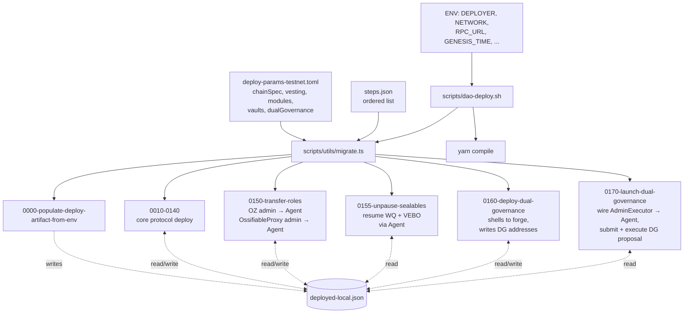
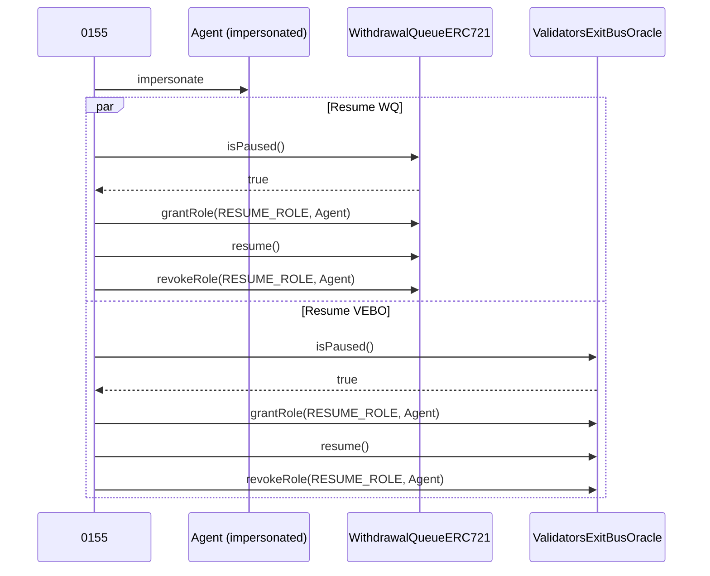
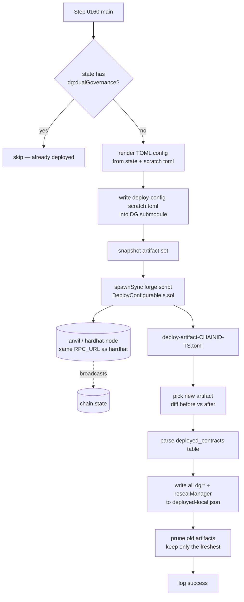
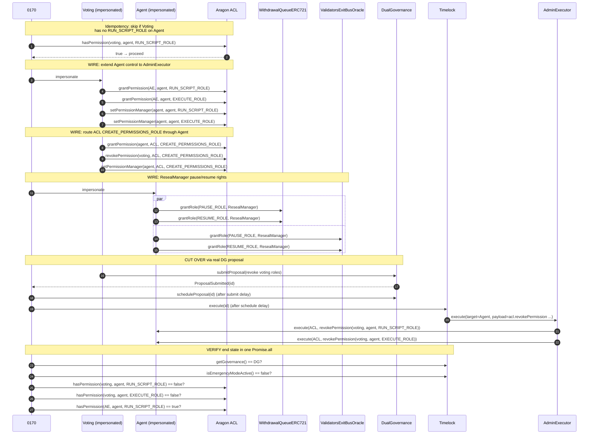
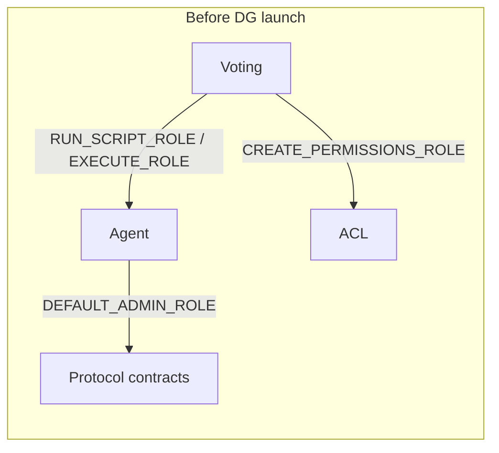
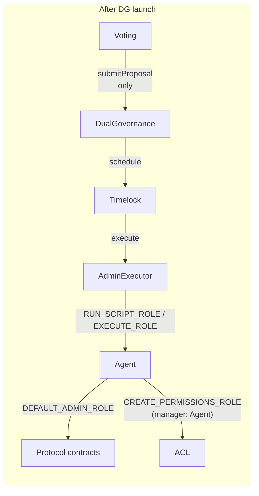
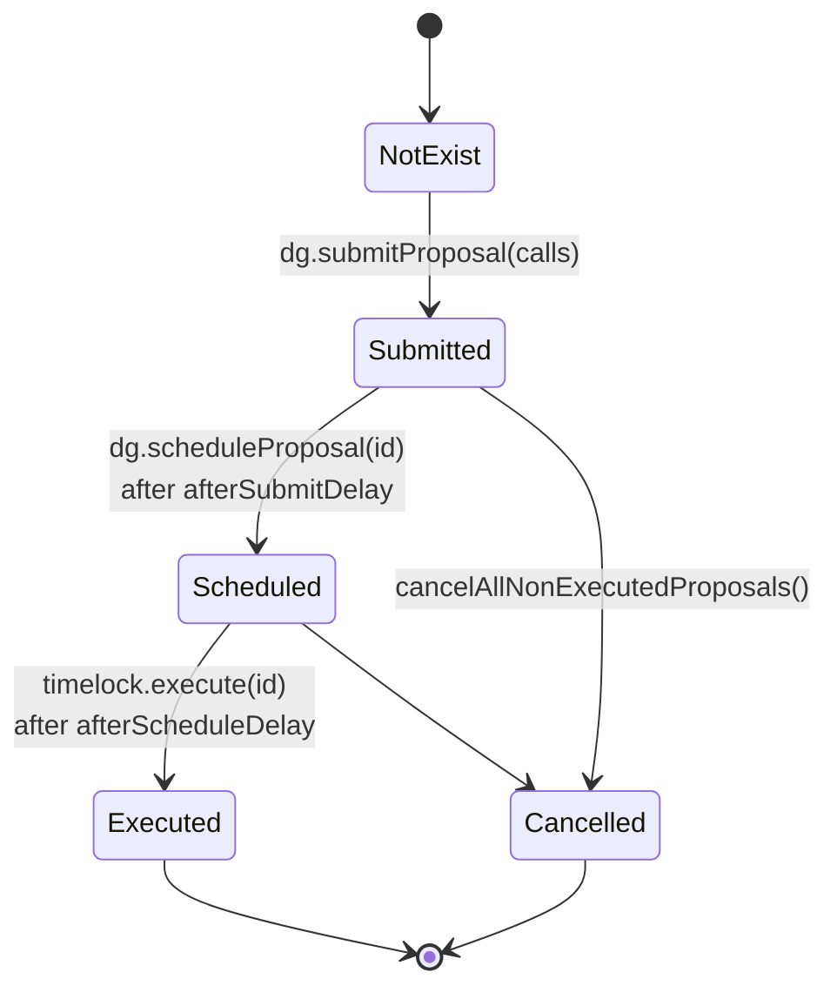

# Scratch Deploy Flow

End-to-end view of how the Lido protocol is deployed from scratch and how Dual
Governance (DG) is wired in. Companion to [scratch-deploy.md](./scratch-deploy.md),
which is the user-facing handbook; this doc is the architect's view — what
moves between the pieces and why.

## Vocabulary

- **Scratch deploy** — runs every step in `scripts/scratch/steps.json` against a
  blank chain (local hardhat-node, anvil, or a fresh testnet) and writes a
  `deployed-<network>.json` file as it goes.
- **Step** — a `.ts` file under `scripts/scratch/steps/` with an `export async function main()`. Steps are run in numeric-prefix order by `scripts/utils/migrate.ts`.
- **Network state file** — `deployed-<network>.json`. Each step reads from and
  appends to it. Acts as the bus between steps.
- **Aragon Voting / Agent** — DAO components from the Aragon stack:
  - **Voting** is the proposer-of-record for governance actions.
  - **Agent** holds protocol-level admin roles (`DEFAULT_ADMIN_ROLE` on
    OZ-AccessControl contracts, ACL permission grants, etc).
- **Dual Governance (DG)** — Lido's two-tier governance with a veto-signalling
  escrow and an emergency-protected timelock. See `foundry/lib/dual-governance`
  (vendored as a submodule, pinned to `v1.0.2`).
- **AdminExecutor** — the executor contract DG uses to call out to Agent.
  After launch, DG drives Agent through it.
- **ResealManager** — DG component that can pause/resume sealable contracts
  (Withdrawal Queue, Validators Exit Bus Oracle).

## High-level flow



## Step inventory

```mermaid
flowchart LR
    subgraph Phase1[Phase 1: Bootstrap]
        S0000[0000<br/>populate from env]
        S0010[0010<br/>deposit contract]
    end

    subgraph Phase2[Phase 2: Aragon]
        S0020[0020<br/>aragon env]
        S0030[0030<br/>template + bases]
        S0040[0040<br/>ENS]
        S0050[0050<br/>APM]
        S0060[0060<br/>app repos]
        S0070[0070<br/>DAO]
        S0080[0080<br/>tokens]
    end

    subgraph Phase3[Phase 3: Protocol]
        S0083[0083<br/>core]
        S0085[0085<br/>vaults]
        S0090[0090<br/>locator]
        S0100[0100<br/>gate seal]
        S0110[0110<br/>finalize DAO]
        S0120[0120<br/>locator inits]
        S0130[0130<br/>roles grant]
        S0140[0140<br/>staking modules]
        S0150[0150<br/>roles transfer]
    end

    subgraph Phase4[Phase 4: Dual Governance]
        S0155[0155<br/>unpause sealables]
        S0160[0160<br/>deploy DG]
        S0170[0170<br/>launch DG]
    end

    Phase1 --> Phase2 --> Phase3 --> Phase4
```



Phase 4 is the new piece this branch adds. Earlier phases are out of scope here;
see `scripts/scratch/steps/` for their bodies.

## State file as the bus

Every step talks to the next via `deployed-<network>.json`. There is no in-memory
hand-off between steps because each step runs in isolation through
`scripts/utils/migrate.ts`, and the integration test process re-imports steps
fresh.

```mermaid
flowchart LR
    direction LR
    StateFile[(deployed-local.json)]

    subgraph Readers
        direction TB
        R0010[0010 reads chainSpec]
        R0150[0150 reads<br/>aragonAcl, app:agent, ...]
        R0160[0160 reads<br/>app:lido, wstETH, WQ,<br/>VEBO, voting]
        R0170[0170 reads<br/>dg:dualGovernance,<br/>dg:adminExecutor,<br/>dg:emergencyProtectedTimelock,<br/>resealManager]
    end

    subgraph Writers
        direction TB
        W0000[0000 writes<br/>chainSpec, deployer]
        W0083[0083 writes<br/>app:lido, accounting, burner, ...]
        W0160[0160 writes<br/>dg:* + resealManager]
    end

    Readers -.read.-> StateFile
    StateFile <-.write.- Writers
```

Access patterns:

- `getAddress(Sk.x, state)` — throws if missing. Used when the step expects the
  entry to exist (e.g. core protocol pieces).
- `tryGetAddress(Sk.x, state)` — returns `undefined`. Used by idempotency
  guards in 0160/0170 to detect "already done."

DG single-address entries use the shape `{ address: "0x…" }` (not
`{ proxy: { address } }`) because none of the upstream DG contracts are
proxies. The exception is `dg:tiebreakerSubCommittees`, which holds an array
under `{ addresses: [...] }` (one entry per committee).

## Phase 4 in detail

### Step 0155: unpause sealables

DG's `addSealableWithdrawalBlocker` rejects paused contracts. Withdrawal Queue
and Validators Exit Bus Oracle ship paused on a fresh deploy (mainnet's WQ has
been resumed for years by the time DG launched there). Step 0155 resumes both
via the Agent (which holds `DEFAULT_ADMIN_ROLE` after step 0150).



Implementation note: WQ and VEBO are unpaused concurrently via `Promise.all`.
The grant/resume/revoke triple is wrapped by the shared `withTemporaryRole`
helper in `lib/role-hashes.ts`.

### Step 0160: deploy DG via forge

Lido core is a hardhat project. DG is a foundry project — it ships its own
`scripts/deploy/DeployConfigurable.s.sol`, which expects a TOML config in
`<dg>/deploy-config/`. Step 0160 bridges them: render config from scratch
state + scratch params, shell out to `forge script`, parse the produced
artifact, write addresses back to scratch state.



Why shell out to `forge` instead of porting DG's deploy to hardhat:

- DG's deploy logic is tightly coupled to its own libraries
  (`DGSetupDeployConfig`, `ContractsDeployment`) — porting would fork the
  source of truth.
- Forge's broadcast model handles cold-state RPC fork patterns better than
  hardhat-deploy. The `--slow` flag serializes broadcasts so anvil can keep up.
- Forge runs against the same node hardhat is connected to (`RPC_URL`), so the
  resulting addresses live on the same chain as the rest of scratch deploy.

### Step 0170: launch DG

The launch is two phases: **wire** (direct ACL/AccessControl mutations
impersonating Voting and Agent, exactly what the production Aragon vote
ceremony would do) and **cut over** (a real DG proposal, submitted, scheduled,
and executed end-to-end).



#### Why the wire phase isn't done via DG proposal

DG can only schedule + execute proposals once it has the ability to call Agent.
Until step 0170 grants `AdminExecutor` `RUN_SCRIPT_ROLE`/`EXECUTE_ROLE` on
Agent, DG is inert. The wire phase is bootstrap; it has to happen out of band.

Mainnet handles this via the Aragon vote ceremony — a real Voting vote from
LDO holders. Scratch impersonates Voting because we only need the resulting
topology, not the ceremony.

#### What scratch reproduces from the mainnet omnibus

Items 1–27 of mainnet's DG launch omnibus are no-ops here because
`LidoTemplate.sol` already creates Lido / NOR / SDVT / Kernel /
EVMScriptRegistry permissions with Agent as both grantee and manager (see
`LidoTemplate.sol:595-619`). Step 0170 reproduces the rest:

- **Items 28–30** — route ACL `CREATE_PERMISSIONS_ROLE` through Agent
  (grant Agent, revoke Voting, set Agent as manager).
- **The DG-proposal item** — submit + schedule + execute a real DG proposal
  that revokes Voting's `RUN_SCRIPT_ROLE`/`EXECUTE_ROLE` on Agent, completing
  the cut-over.

ResealManager `PAUSE_ROLE`/`RESUME_ROLE` grants on the sealables are also part
of mainnet's omnibus; on scratch, Agent (which holds `DEFAULT_ADMIN_ROLE` on
both contracts post-0150) grants them directly rather than through a
ceremonial vote.

## Governance topology: before vs after





Voting still exists and is still the admin proposer for DG, but it can no
longer call Agent directly. Every protocol-modifying action now goes through
the timelock; the veto-signalling escrow can stop a malicious proposal between
submission and execution.

## Proposal lifecycle (timelock)

The DG `EmergencyProtectedTimelock` enforces this state machine on every
proposal:



`scripts/utils/upgrade.ts:executeDGProposal` walks an already-submitted
proposal through schedule and execute, advancing chain time across both delays
and (for mainnet's launch omnibus) retrying past `TimeConstraints` windows.
Step 0170 calls this with `retryOnTimeConstraint: false` because scratch has
no time windows; `mockDGAragonVoting` (used by upgrade-on-fork tests) calls it
with `retryOnTimeConstraint: true`.

## CI flow

```mermaid
sequenceDiagram
    participant CI as GitHub Actions
    participant Setup as setup/action.yml
    participant Node as hardhat-node service
    participant Deploy as ./scripts/dao-deploy.sh
    participant Mine as scripts/utils/mine.ts
    participant Tests as test:integration:fork:local

    CI->>Setup: actions/checkout (submodules: recursive)
    Setup->>Setup: setup-node + foundry-toolchain
    CI->>Node: start hardhat-node:2.26.0-scratch
    CI->>Deploy: NETWORK=local, RPC_URL=http://localhost:8555
    Deploy->>Node: scratch steps 0000-0170
    Note over Deploy,Node: forge invoked from 0160<br/>broadcasts against same RPC
    Deploy-->>CI: deployed-local.json
    CI->>Mine: finalize chain
    CI->>Tests: MODE=scratch hardhat test test/integration
    Tests->>Node: re-runs steps;<br/>idempotency guards make 0155/0160/0170<br/>skip on second pass
    Tests->>Node: run all integration tests
```

The integration test process sets `MODE=scratch`, which makes
`getProtocolContext()` re-execute every step before tests run. This works
because each step is idempotent against an already-deployed network; for the
DG steps specifically:

- `0155` checks `await c.isPaused()` and bails if already resumed.
- `0160` checks `tryGetAddress(Sk.dgDualGovernance, state)` and bails if set.
- `0170` checks `aclHasPermission(voting, agent, RUN_SCRIPT_ROLE)` and bails
  if already revoked.

## Opt-out

DG is enabled by default on testnet/local profiles. To deploy without DG,
remove these three steps from `scripts/scratch/steps.json`:

- `scratch/steps/0155-unpause-sealables`
- `scratch/steps/0160-deploy-dual-governance`
- `scratch/steps/0170-launch-dual-governance`

The `[dualGovernance]` section in `scripts/scratch/deploy-params-testnet.toml`
is `.optional()` in the schema, so you can leave it in place.

## Files of interest

| File                                                         | Role                                                            |
| ------------------------------------------------------------ | --------------------------------------------------------------- |
| `scripts/dao-deploy.sh`                                      | Entry point; sets `STEPS_FILE` and runs `migrate.ts`            |
| `scripts/utils/migrate.ts`                                   | Iterates `steps.json`, imports each step, calls `main()`        |
| `scripts/scratch/steps.json`                                 | Ordered list of step paths                                      |
| `scripts/scratch/deploy-params-testnet.toml`                 | All deploy parameters (DG section at the bottom)                |
| `scripts/scratch/steps/0155-unpause-sealables.ts`            | DG prerequisite                                                 |
| `scripts/scratch/steps/0160-deploy-dual-governance.ts`       | Forge invocation + state writeback                              |
| `scripts/scratch/steps/0170-launch-dual-governance.ts`       | Topology wiring + DG launch proposal                            |
| `scripts/utils/upgrade.ts`                                   | Shared `executeDGProposal` helper                               |
| `lib/state-file.ts`                                          | `Sk` enum, `getAddress`, `tryGetAddress`, `persistNetworkState` |
| `lib/role-hashes.ts`                                         | Role hash constants, `aclHasPermission`, `withTemporaryRole`    |
| `lib/config-schemas.ts`                                      | Zod schema for `[dualGovernance]`                               |
| `foundry/lib/dual-governance/`                               | DG submodule (pinned to v1.0.2)                                 |
| `test/integration/dual-governance/dg-scratch.integration.ts` | Post-launch topology assertions                                 |
