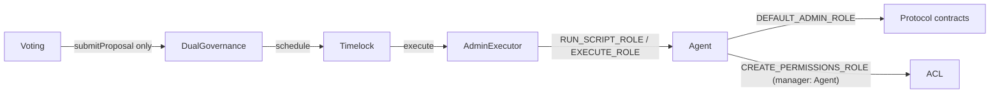
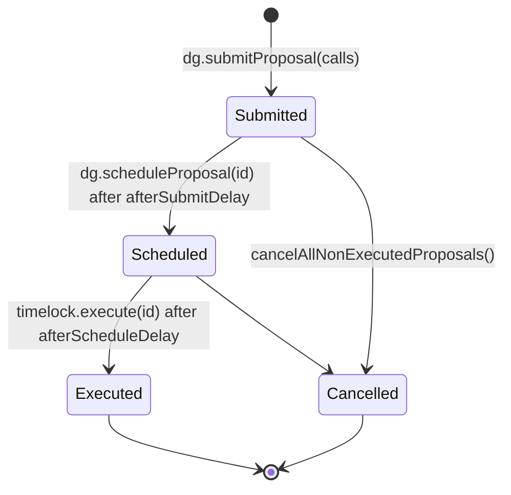

# Deploy Lido protocol middleware from scratch

How to run, configure, and verify a scratch deploy. The
[Architecture & internals](#architecture--internals) section at the end covers
how the pipeline works (step mechanics, Dual Governance wiring, state-file
semantics, CI). For why integration tests behave differently on external nodes
(anvil) than on the in-process hardhat node — and how to write tests that pass
on both — see [external-node-test-compat.md](./external-node-test-compat.md).

## TL;DR

```shell
# Start a local Ethereum node
anvil -p 8555 --base-fee 0 --gas-price 0

# In a separate terminal, run the deployment script
bash scripts/dao-local-deploy.sh
```

### Sepolia fork

Same flow, but anvil forks Sepolia (preserving chainId 11155111, which triggers `0010-deploy-deposit-contract` to deploy `SepoliaDepositAdapter` wrapping Sepolia's real beacon deposit contract):

```shell
# Terminal 1 — fork Sepolia
anvil --fork-url "$SEPOLIA_RPC_URL" -p 8555 --base-fee 0 --gas-price 0

# Terminal 2 — deploy
bash scripts/dao-sepolia-fork-deploy.sh
```

### Output modes (quiet by default, or full)

By default the deploy scripts **self-log**: the full deploy + test output (gas reports, per-tx traces, ~700 mocha test ticks) is teed to a log file, and only milestones, mocha counts (`N passing / N pending / N failing`), failure bullets, assertion/provider errors, and the tail of the log reach the terminal. A periodic heartbeat reports elapsed time and log growth, so a long quiet phase (e.g. a slow integration test — mocha lets each run up to 20 min before timing out) isn't mistaken for a freeze. This is friendly for both automation / LLM agents and humans who want signal over noise.

```shell
# Quiet (default), log at logs/scratch-deploy.log (override via LOG_FILE env):
bash scripts/dao-local-deploy.sh
bash scripts/dao-sepolia-fork-deploy.sh          # logs/scratch-deploy-sepolia-fork.log
```

To get the raw, unfiltered firehose straight to the terminal instead, pass `--full` (or set `FULL_OUTPUT=1`):

```shell
bash scripts/dao-local-deploy.sh --full
FULL_OUTPUT=1 bash scripts/dao-sepolia-fork-deploy.sh
```

The test suites have their own quiet variants with dedicated log files:

```shell
yarn test:integration:fork:local:agent   # logs/integration-fork-local.log
yarn test:integration:scratch:agent      # logs/integration-scratch.log
yarn test:integration:agent              # logs/integration-tests.log (forking mode)
```

The deploy scripts and the `yarn …:agent` variants all route through `scripts/run-logged.sh <logfile> <command...>`, which you can use to wrap any long-running command the same way (heartbeat included; disable it with `HEARTBEAT_SECONDS=0`).

## Requirements

Same as for the rest of the repo, see [CONTRIBUTING.md](../CONTRIBUTING.md).

In addition, scratch deploy installs Dual Governance from the bundled
`foundry/lib/dual-governance` submodule via `forge script`, so the deploy host
needs:

- `forge` on `PATH` (Foundry; same toolchain used elsewhere in the repo)
- The submodule initialised: `git submodule update --init --recursive` after
  cloning. CI workflows must use `actions/checkout@v4` with `submodules: recursive`.

## General Information

The repository contains bash scripts for deploying the DAO across various environments:

- Local Node Deployment - `scripts/dao-local-deploy.sh` (Supports Ganache, Anvil, Hardhat Network, and other local
  Ethereum nodes)

The protocol requires configuration of numerous parameters for a scratch deployment. These live in a TOML
deploy-params file — by default `scripts/scratch/deploy-params-testnet.toml` (override with the
`SCRATCH_DEPLOY_CONFIG` env var). It is tailored for testnet deployments — shorter vote durations, more frequent
oracle report cycles, and the `[dualGovernance]` block — and differs from a mainnet setup. The Zod schema that
validates it is `lib/config-schemas.ts`; the loader is `scripts/utils/scratch.ts`.

> [!NOTE]
> Network-specific values (deployer, genesis time, deposit contract, …) are intentionally left `null` in the
> rendered state file and filled in from environment variables during step `0000`.

The first deployment step (`0000-populate-deploy-artifact-from-env.ts`) seeds the network state file from this config:

1. `resetStateFileFromDeployParams()` reads the TOML, converts it to deployment-state shape
   (`scratchParametersToDeploymentState`), and writes it to `deployed-<network name>.json` — the file pointed at by
   `NETWORK_STATE_FILE`, where `<network name>` is a network configured in `hardhat.config.ts`.

2. Step `0000` then layers in the env-var values (`DEPLOYER`, `GENESIS_TIME`, `GENESIS_FORK_VERSION`,
   `DEPOSIT_CONTRACT`, …). Every later step appends its deployed contract addresses and transaction hashes to the
   same file.

Detailed information for each setup is provided in the sections below.

> [!NOTE]
> Aragon UI for Lido DAO is to be deprecated and replaced by a custom solution, thus not included in the deployment
> script, see https://research.lido.fi/t/discontinuation-of-aragon-ui-use/7992.

### Deployment Steps

A detailed overview of the deployment script's process:

- Prepare `deployed-<network name>.json` file
  - Rendered from `scripts/scratch/deploy-params-testnet.toml` by step `0000`
  - Enhanced with environment variable values, e.g., `DEPLOYER`
  - Progressively updated with deployed contract information
- (optional) Deploy DepositContract
  - Skipped if DepositContract address is pre-specified
- (optional) Deploy ENS
  - Skipped if ENS Registry address is pre-specified
- Deploy Aragon framework environment
- Deploy standard Aragon apps contracts (e.g., `Agent`, `Voting`)
- Deploy `LidoTemplate` contract
  - Auxiliary contract for DAO configuration
- Deploy Lido custom Aragon apps implementations (bases) for `Lido`, `NodeOperatorsRegistry`
- Register Lido APM name in ENS
- Deploy Aragon package manager contract `APMRegistry` (via `LidoTemplate`)
- Deploy Lido custom Aragon apps repo contracts (via `LidoTemplate`)
- Deploy Lido DAO (via `LidoTemplate`)
- Issue DAO tokens (via `LidoTemplate`)
- Deploy non-Aragon Lido contracts: `OracleDaemonConfig`, `LidoLocator`, `OracleReportSanityChecker`, `EIP712StETH`,
  `WstETH`, `WithdrawalQueueERC721`, `WithdrawalVault`, `LidoExecutionLayerRewardsVault`, `StakingRouter`,
  `DepositSecurityModule`, `AccountingOracle`, `HashConsensus` for AccountingOracle, `ValidatorsExitBusOracle`,
  `HashConsensus` for ValidatorsExitBusOracle, `Burner`
- Finalize Lido DAO deployment: issue unvested LDO tokens, set Aragon permissions, register Lido DAO name in Aragon ID
  (via `LidoTemplate`)
- Initialize non-Aragon Lido contracts
- Set parameters of `OracleDaemonConfig`
- Setup non-Aragon permissions
- Plug NodeOperatorsRegistry as Curated staking module
- Unpause sealable withdrawal blockers (`0145`) — resume `WithdrawalQueueERC721`
  and `ValidatorsExitBusOracle` so the upcoming DG deploy can register them as
  withdrawal blockers; skipped when DG is disabled
- Transfer all admin roles from deployer to `Agent` (`0150`)
  - OpenZeppelin admin roles: `Burner`, both `HashConsensus` instances,
    `StakingRouter`, `AccountingOracle`, `ValidatorsExitBusOracle`,
    `WithdrawalQueueERC721`, `OracleDaemonConfig`, `OracleReportSanityChecker`,
    `TriggerableWithdrawalsGateway`, `VaultHub`, `PredepositGuarantee`,
    `OperatorGrid`, `LazyOracle`
  - OssifiableProxy admin roles for the proxied contracts
  - `DepositSecurityModule` owner
- Deploy and launch Dual Governance (`0160`) — deploys the DG contracts from the
  `foundry/lib/dual-governance` submodule via `forge script`, records their
  addresses in the network state file, wires `ResealManager` pause/resume rights
  on the sealables, and performs the governance hand-off on-chain via
  `LidoTemplate.finalizePermissionsAfterDGDeployment(adminExecutor)` (Voting
  loses direct Agent control; DG's AdminExecutor gains it). No impersonation —
  works on a live network. Mechanics and rationale:
  [Architecture & internals](#architecture--internals).

To opt out of DG, set `DG_DEPLOYMENT_ENABLED=false` (any of `false`/`0`/`off`/`no`,
case-insensitive; default is enabled). With the toggle off, step `0145` is a
no-op, step `0150` renounces WQ/VEBO admin immediately, and step `0160` calls
`LidoTemplate.finalizePermissionsWithoutDGDeployment()` (keeps Voting as
permission manager) before setting the template owner to Agent.

### Dual Governance configuration

The `[dualGovernance]` section of the deploy-params toml mirrors the structure
of `dual-governance/deploy-config/deploy-config-mainnet.toml`. Timings are short
(15 min `after_submit_delay`, 5 min veto signalling, etc.) so integration tests
don't have to advance time across multi-day mainnet windows. Committee
addresses default to anvil dev accounts — replace them per network when running
against real testnets:

- `dualGovernance.resealCommittee` — Gnosis Multisig on mainnet
- `dualGovernance.timelock.emergencyProtection.{emergencyGovernanceProposer,
emergencyActivationCommittee, emergencyExecutionCommittee}`
- `dualGovernance.tiebreaker.committees[N].members`

## Deployment Environments

### Local Deployment

This section describes how to deploy the DAO to a local development node (such as Anvil, Hardhat, or Ganache) running
at http://127.0.0.1:8555.

The deployment process utilizes the default test account `0xf39Fd6e51aad88F6F4ce6aB8827279cffFb92266`, which is derived
from the standard mnemonic phrase: `test test test test test test test test test test test junk`

To ensure a successful deployment, configure your local node with the default test accounts associated with this
mnemonic.

Follow these steps for local deployment:

1. Run `yarn install` (ensure repo dependencies are installed)
2. Run the node on port 8555 (for the commands, see subsections below)
3. Run the script `bash scripts/dao-local-deploy.sh` from root repo directory
4. Check out the artifacts in `deployed-local.json`

#### Supported Local Nodes

##### Anvil

```shell
anvil -p 8555 --mnemonic "test test test test test test test test test test test junk" --base-fee 0 --gas-price 0
```

##### Hardhat Node

```shell
yarn hardhat node
```

### Testnet Deployment

To do a testnet deployment, the following parameters must be set up via env variables:

- `DEPLOYER`. The deployer address. The deployer must own its private key. To ensure proper operation, it should have an
  adequate amount of ether. The total deployment gas cost is approximately 120,000,000 gas, and this cost can vary based
  on whether specific components of the environment, such as the DepositContract, are deployed or not.
- `RPC_URL`. Address of the Ethereum RPC node to use, e.g.: `https://<network>.infura.io/v3/<yourProjectId>`
- `GENESIS_TIME`. Beacon chain genesis timestamp of the network, e.g. `1655733600` for Sepolia. Required (no default).
- `GENESIS_FORK_VERSION`. Genesis fork version of the network to use, e.g. `0x00000000` for Mainnet, `0x90000069` for Sepolia,
  `0x10000910` for Hoodi. Used to properly calculate the deposit domain for the network.
- `GAS_PRIORITY_FEE`. Gas priority fee. By default set to `2`
- `GAS_MAX_FEE`. Gas max fee. By default set to `100`
- `GATE_SEAL_FACTORY`. Address of the [GateSeal Factory](https://github.com/lidofinance/gate-seals) contract. Must be
  deployed in advance. Can be set to any `0x0000000000000000000000000000000000000000` to debug deployment
- `WITHDRAWAL_QUEUE_BASE_URI`. BaseURI for WithdrawalQueueERC721. By default not set (left an empty string)
- `DSM_PREDEFINED_ADDRESS`. Address to use instead of deploying `DepositSecurityModule` or `null` otherwise. If used,
  the deposits can be made by calling `Lido.deposit` from the address.

Also you need to specify the `DEPLOYER` private key in `accounts.json` under `/eth/<network>` like `"<network>": ["<key>"]`.
See [`accounts.sample.json`](../accounts.sample.json) for the schema. Both `accounts.json` and `.env` are gitignored,
so secrets stay local.

To start the deployment, run `scripts/dao-deploy.sh` with `NETWORK` set to a network configured in
`hardhat.config.ts` (e.g. `sepolia`, `hoodi`, `mainnet`). All env variables listed above must be in scope —
typically loaded from `.env`:

```shell
NETWORK=hoodi \
NETWORK_STATE_FILE=deployed-hoodi.json \
bash scripts/dao-deploy.sh
```

`NETWORK_STATE_FILE` defaults to `deployed-<network>.json` if unset; override it (e.g.
`deployed-hoodi-scratch-test.json`) to keep multiple parallel deploys side by side. The deploy params come from
`scripts/scratch/deploy-params-testnet.toml` unless `SCRATCH_DEPLOY_CONFIG` overrides it.

Deployment artifacts will be stored in the file pointed at by `NETWORK_STATE_FILE`.

## Post-Deployment Tasks

### state-mate check (runs automatically)

`dao-deploy.sh` finishes with a [state-mate](https://github.com/lidofinance/state-mate)
run that calls view functions on every deployed contract and diffs the results against
the expectations in `scripts/scratch/state-mate/scratch.yaml` (~2000 checks: wiring,
proxy admins/implementations, roles/ACL topology, deploy parameters). state-mate is
vendored as the `foundry/lib/state-mate` submodule.

The committed `scratch.yaml` holds only the _wiring_ — addresses and deploy-dependent
values are referenced via YAML aliases whose anchors live in generated sibling files
(state-mate's `.deployed`/`.inputs` feature). `prepare-state-mate-check.ts` derives
them, plus the `abi/` directory, from the network state file and the compile artifacts,
so no explorer access is needed and the check works on a blank local node.

Dual-governance checks sit in the config's `l2` section (state-mate only allows `l1`/`l2`
section names; both point at the same chain). When the state file has no DG entries the
check runs with `--only l1`. Set `STATE_MATE_CHECK=off` to skip the check entirely.

To re-run the check by hand against an existing deployment:

```shell
NETWORK_STATE_FILE=deployed-local.json yarn ts-node scripts/scratch/state-mate/prepare-state-mate-check.ts
cd foundry/lib/state-mate
LOCAL_RPC_URL=http://127.0.0.1:8555 yarn start "$(pwd)/../../../scripts/scratch/state-mate/scratch.yaml"
```

When the deployment surface changes (a contract added/removed from the state file), the
generator fails listing the unmapped keys — extend its mapping tables and add a matching
contract entry (state-mate requires every non-mutable function to be either checked or
explicitly skipped with an empty value) in `scratch.yaml`.

### Verifying a Live-Testnet Scratch Deployment

The integration suite uses anvil/hardhat-only RPC methods
(`evm_snapshot`/`evm_revert`, `hardhat_setCode`, `*_impersonateAccount`,
chain-time manipulation), so it never runs against the live chain itself —
it always works on a fork. There are two distinct modes; pick by what you
want to verify:

**Verify an existing deployment (forking mode)** — this is what testnet CI
(`tests-integration-hoodi.yml`) runs. Hardhat forks the RPC in-process and
the suite tests the contracts recorded in the deployment artifact; nothing
is deployed, the live chain is never written to:

```shell
RPC_URL="$HOODI_RPC_URL" \
NETWORK_STATE_FILE=deployed-hoodi.json \
yarn test:integration
```

For Sepolia, substitute the RPC and `deployed-sepolia.json` (or whichever
filename you passed to the deploy step). `RPC_URL` can be the live testnet
RPC directly or a local node in front of it.

The DG suite (`dg-scratch.integration.ts`) runs as part of this whenever the
artifact has `dg:adminExecutor` recorded (i.e. the deploy ran with DG), the
network is not mainnet, and `DG_DEPLOYMENT_ENABLED` is not set to a falsy
value. It asserts the post-launch topology (`timelock.governance ==
dualGovernance`, zero launch proposals), the role moves (AdminExecutor has
Agent's `RUN_SCRIPT`/`EXECUTE`, Voting doesn't; Agent owns
`CREATE_PERMISSIONS_ROLE`), ResealManager wiring on every sealable, and an
end-to-end no-op proposal routed Voting → DG → AdminExecutor → Agent. If the
artifact has no DG entries, the suite self-skips and the core tests continue.

To run only the DG suite for fast feedback on the governance hand-off:

```shell
RPC_URL="$HOODI_RPC_URL" \
NETWORK_STATE_FILE=deployed-hoodi.json \
MODE=forking \
yarn hardhat test test/integration/dual-governance/dg-scratch.integration.ts
```

Caveats:

- Verify promptly after deploy. The DG test asserts
  `timelock.getProposalsCount() == 0`; if anyone submits a proposal to the
  testnet's DG between deploy and verification, that assertion fails.
- Voting, Agent, and the deployer are impersonated on the fork. Don't expect
  the same calls to succeed against the live RPC.
- On Sepolia (forks included), tests that make variable-amount beacon
  deposits — PDG predeposits/activations/top-ups, stVault unguaranteed and
  side deposits — self-skip and show up as pending. Sepolia's deposit
  contract reconstructs every `deposit_data_root` with a hardcoded 32 ETH
  and refunds `msg.value`, so such deposits can never succeed there: not in
  tests, and not in a real deployment either. See
  `supportsVariableDepositAmounts` in `lib/protocol/types.ts`.

**Re-deploy and test from scratch (scratch mode)** — `yarn
test:integration:fork:local` (`MODE=scratch`, network `local`) does **not**
verify an existing deployment: the test process performs a complete fresh
scratch deploy against `LOCAL_RPC_URL` (step `0000` resets the state file
from the deploy params, then every step runs — including a second forge DG
deploy) and tests the instance it just deployed. This answers "does scratch
deploy work against this chain", which is what scratch CI runs against a
blank node. Two warnings:

- Step `0000` **overwrites** whatever `NETWORK_STATE_FILE` points at. Never
  aim it at a deployment artifact you want to keep — copy the file first.
- The chain accumulates a full extra protocol instance per run; only use
  disposable forks/nodes.

**How `dao-local-deploy.sh` runs the suite — deploy on anvil, test on a
fork of it.** The deploy script does _not_ drive the external anvil with the
test suite (the old `test:integration:fork:local`, `MODE=scratch --network
local` path). It deploys once to anvil (DG step `0160` needs a real RPC for
`forge --broadcast`), then runs `yarn test:integration` (`MODE=forking`) so the
suite runs on an **in-process hardhat node that forks that anvil**, with
`PROVISION_ON_FORK=1`. Two reasons:

- **Isolation.** The suite isolates tests with `evm_snapshot`/`evm_revert`
  plus month-scale `evm_setNextBlockTimestamp` jumps. That isolation is only
  reliable on the in-process node; driving the external anvil over a full
  ~800-test run lets snapshot state degrade (cf. the ~6k-block caveat in
  `test/integration/core/dsm-pause-deposits.integration.ts`), which cascades
  into spurious failures and an eventual mid-suite deadlock (a submitted tx
  that never mines, blocking until mocha's 20-min timeout). On the fork the
  same suite is green and finishes in ~1 minute; anvil is never mutated by the
  tests.
- **Provisioning + `isScratch`.** A scratch deploy is deployed-but-not-
  operational, so the fork self-provisions (oracle committee, hash-consensus
  initial epoch, unpause, seed TVL) via `provision()` — the same setup a
  `MODE=scratch` run does, here run on the fork instead of on anvil. Because the
  protocol under test is still a scratch deployment (agent holds the powers,
  no EasyTrack), `getProtocolContext` reports `ctx.isScratch = true` even though
  it didn't redeploy, so tests that branch on `ctx.isScratch` (e.g.
  `staking-module`, `circuit-breaker-pause`) take the scratch path. `MODE` and
  `PROVISION_ON_FORK` are wired in `lib/protocol/context.ts`; the forking-mode
  state-file reader is `getForkingNetworkConfig` in `lib/protocol/networks.ts`.

### Publishing Sources to Etherscan

```shell
yarn verify:deployed --network <network> (--file <path-to-deployed-json>)
```

#### Issues with verification of part of the contracts deployed from factories

There are some contracts deployed from other contracts for which automatic hardhat etherscan verification fails:

- `AppProxyUpgradeable` of multiple contracts (`app:lido`, `app:node-operators-registry`, `app:oracle`,
  `app:voting`, ...)
- `KernelProxy` -- proxy for `Kernel`
- `AppProxyPinned` -- proxy for `EVMScriptRegistry`
- `MiniMeToken` -- LDO token
- `CallsScript` -- Aragon internal contract
- `EVMScriptRegistry` -- Aragon internal contract

The workaround used during Holesky deployment is to deploy auxiliary instances of these contracts standalone and verify
them via hardhat Etherscan plugin. After this Etherscan will mark the target contracts as verified by "Similar Match
Source Code".

Note that some contracts require additional auxiliary contracts to be deployed. Namely, the constructor of
`AppProxyPinned` depends on proxy implementation ("base" in Aragon terms) contract with `initialize()` function and
`Kernel` contract, which must return the implementation by call `kernel().getApp(KERNEL_APP_BASES_NAMESPACE, _appId)`.
See `@aragon/os/contracts/apps/AppProxyBase.sol` for the details.

### Initialization to Fully Operational State

In order to make the protocol fully operational, the following additional steps are required:

- add oracle committee members to `HashConsensus` contracts for `AccountingOracle` and `ValidatorsExitBusOracle`:
  `HashConsensus.addMember`;
- initialize initial epoch for `HashConsensus` contracts for `AccountingOracle` and `ValidatorsExitBusOracle`:
  `HashConsensus.updateInitialEpoch`;
- add guardians to `DepositSecurityModule`: `DepositSecurityModule.addGuardians`;
- resume protocol: `Lido.resume`;
- resume WithdrawalQueue: `WithdrawalQueueERC721.resume`;
- add at least one Node Operator: `NodeOperatorsRegistry.addNodeOperator`;
- add validator keys to the Node Operators: `NodeOperatorsRegistry.addSigningKeys`;
- set staking limits for the Node Operators: `NodeOperatorsRegistry.setNodeOperatorStakingLimit`.

> [!NOTE]
> Some of these actions require prior granting of the required roles, e.g. `STAKING_MODULE_MANAGE_ROLE` for
> `StakingRouter.addStakingModule`:

```js
await stakingRouter.grantRole(STAKING_MODULE_MANAGE_ROLE, agent.address, { from: agent.address });
await stakingRouter.addStakingModule(
  state.nodeOperatorsRegistry.deployParameters.stakingModuleTypeId,
  nodeOperatorsRegistry.address,
  NOR_STAKING_MODULE_STAKE_SHARE_LIMIT_BP,
  NOR_STAKING_MODULE_PRIORITY_EXIT_SHARE_THRESHOLD_BP,
  NOR_STAKING_MODULE_MODULE_FEE_BP,
  NOR_STAKING_MODULE_TREASURY_FEE_BP,
  NOR_STAKING_MODULE_MAX_DEPOSITS_PER_BLOCK,
  NOR_STAKING_MODULE_MIN_DEPOSIT_BLOCK_DISTANCE,
  { from: agent.address },
);
await stakingRouter.renounceRole(STAKING_MODULE_MANAGE_ROLE, agent.address, { from: agent.address });
```

## Compatibility matrix

Quick reference across the three independent choices: **chain spec** (blank / Sepolia
fork), **DG** (on / off), and **test scenario** (A–D from
[testing.md](./testing.md)). "Tests mutate the node" = scenario C (`--network local`,
direct); "tests use their own fork" = scenario D (in-process EDR forks the node).

### Scratch deploy

All four `(blank / Sepolia fork) × (DG on / off)` combinations deploy successfully
against both an external hardhat node and anvil. The in-process node (scenario A)
cannot deploy DG: `forge` needs an HTTP RPC and the in-process node exposes none.

| Node                                | Chain spec                                      |          DG on          |  DG off  |
| ----------------------------------- | ----------------------------------------------- | :---------------------: | :------: |
| External hardhat-node               | blank (`genesisForkVersion = 0x00000000`)       |          ✅ CI          |  ✅ CI   |
| External hardhat-node               | Sepolia fork (`0x90000069`, chainId `11155111`) |          ✅ CI          |  ✅ CI   |
| External anvil                      | blank                                           |        ✅ local         | ✅ local |
| External anvil                      | Sepolia fork                                    |        ✅ local         | ✅ local |
| In-process hardhat (`MODE=scratch`) | blank                                           | ❌ forge needs HTTP RPC |    ✅    |

Sepolia-fork jobs use `ghcr.io/lidofinance/hardhat-node:2.28.0-sepolia` (chainId
`11155111`); step `0010` takes the `SepoliaDepositAdapter` branch there and nowhere
else.

### Integration tests — scenario A: in-process scratch (`test:integration:scratch`)

Self-contained; no external node. Always forces `DG_DEPLOYMENT_ENABLED=false`.

| DG  | Result                                                               |
| --- | -------------------------------------------------------------------- |
| on  | ❌ — command forces DG off; `forge` cannot reach the in-process node |
| off | ✅                                                                   |

### Integration tests — scenario C: direct to external node (`test:integration:fork:local`)

Tests connect to the external node with `--network local` and **mutate it directly**
(snapshots, `evm_revert`, and the in-test re-deploy all happen on that same node).

| Backend      | Chain spec   |  DG on   |  DG off  |
| ------------ | ------------ | :------: | :------: |
| hardhat-node | blank        |  ✅ CI   |  ✅ CI   |
| hardhat-node | Sepolia fork | ✅ CI ⚠️ | ✅ CI ⚠️ |
| anvil        | blank        |    ✅    |    ✅    |
| anvil        | Sepolia fork |  ✅ ⚠️   |  ✅ ⚠️   |

⚠️ **Sepolia fork**: ~14 tests self-skip (`supportsVariableDepositAmounts = false` on
chainId `11155111`). Sepolia's deposit contract hardcodes 32 ETH in the
`deposit_data_root` reconstruction; variable-amount deposits (PDG predeposit,
stVault unguaranteed / side) are structurally impossible there — not a test bug.

### Integration tests — scenario D: tests use their own in-process fork (`test:integration` against a local node)

The in-process EDR node forks the external node; **the external node is never
mutated**. `dao-local-deploy.sh` uses this pattern (deploy to anvil, then
`yarn test:integration` with `PROVISION_ON_FORK=1`). **Anvil only** — a plain
hardhat node returns `nonce: null` for the pending block, which EDR rejects at
`evm_revert` time, collapsing snapshot isolation.

| Backend      |               DG on               | DG off |
| ------------ | :-------------------------------: | :----: |
| anvil        |                ✅                 |   ✅   |
| hardhat-node | ❌ `nonce: null` on pending block |   ❌   |

### Structural limits at a glance

| Constraint                                      | Root cause                                          | Fix / workaround                                                          |
| ----------------------------------------------- | --------------------------------------------------- | ------------------------------------------------------------------------- |
| DG cannot deploy in-process (scenario A)        | `forge` needs an HTTP RPC                           | Use scenario C with an external node                                      |
| Scenario D breaks on hardhat-node backend       | EDR rejects `nonce: null` from pending block        | Switch to anvil, or use scenario C                                        |
| Sepolia variable-amount deposit tests skip      | Deposit contract hardcodes 32 ETH in root           | Structural — run blank node for full deposit coverage                     |
| `ECONNRESET` after `forge` on hardhat-node      | Keep-alive socket closed during 30–60 s forge pause | `reEstablishRpcAfterForge()` in step 0160 (already applied)               |
| chainId not inherited on a plain `hardhat node` | hardhat node defaults chainId to `31337`            | Set `HARDHAT_CHAIN_ID=11155111` in the forked node's config, or use anvil |

## Architecture & internals

How the pipeline is wired and why. For step bodies, see `scripts/scratch/steps/`.

### Vocabulary

- **Step** — a `.ts` file under `scripts/scratch/steps/` exporting `async main()`,
  run in numeric-prefix order per `steps.json`.
- **Network state file** — `deployed-<network>.json`, the bus between steps: each
  reads from and appends to it. There is no in-memory hand-off — each step runs
  in isolation via `scripts/utils/migrate.ts` (or `lib/scratch.ts:applyDeploySteps` in
  tests).
- **Voting / Agent** — Aragon DAO components. Voting is the proposer-of-record;
  Agent holds protocol admin (OZ `DEFAULT_ADMIN_ROLE`, ACL grants).
- **Dual Governance (DG)** — Lido's two-tier governance (veto-signalling escrow +
  emergency-protected timelock), vendored at `foundry/lib/dual-governance`
  (submodule, pinned `v1.0.2`). **AdminExecutor** is the contract DG drives Agent
  through; **ResealManager** can pause/resume the sealables.
- **LidoTemplate** — the Aragon DAO factory; owns the permission bootstrap. The DG
  launch is one of its finalize paths.

### What "scratch" means: recipe, run, result, test-knob

"Scratch deploy" gets used for a recipe, a run, a result, and a test knob
interchangeably. Pulling them apart removes most of the confusion in this doc — and
explains the `isScratch` naming below, which otherwise reads backwards:

- **The recipe** — the 20 steps under `scripts/scratch/steps/` plus `steps.json`. It
  is driven by **two near-duplicate orchestrators over the same step list**:
  - `scripts/utils/migrate.ts` — the **production** driver (`dao-deploy.sh`; real
    testnet/mainnet). Lets the node mine each tx normally.
  - `lib/scratch.ts:applyDeploySteps` (via `deployScratchProtocol`) — the **test** driver
    (`MODE=scratch`). Adds an `evm_mine` after every step because the in-process node
    does not auto-mine the way an external node does.
    Same steps, different driver — see the [CI](#ci) caveat.
- **A run** — one dated execution of the recipe against one chain (~120M gas; the tx
  hashes land in the state file). Two runs against the same node leave two full
  protocol instances on it.
- **The result** — the contracts now on-chain. Its _description/carrier_ is the
  **state file** `deployed-<network>.json`: the inter-step bus, **ephemeral** on the
  scratch/CI path (step `0000` rewrites it every run), durable only if you copy it out.
- **`MODE=scratch`** — a **test** knob, not a property of the deploy: "re-deploy the
  whole protocol in-process now" (vs `MODE=forking` = "discover an existing
  deployment"). See [testing.md](./testing.md).
- **`isScratch`** — a property of the **protocol under test**, _not_ of how it was
  deployed: Agent still holds the powers and there is no EasyTrack (the pre-launch
  governance shape). That is why it is true even when `PROVISION_ON_FORK` _discovers_ a
  scratch instance on a fork **without redeploying it** — the shape is scratch even
  though no scratch run happened in that process.

### State file access

- `getAddress(Sk.x, state)` — throws if missing (entry must exist).
- `tryGetAddress(Sk.x, state)` — returns `undefined`; used by 0160's resume guard
  to detect "forge already ran".

DG single-address entries use `{ address: "0x…" }` (no upstream DG contract is a
proxy); `dg:tiebreakerSubCommittees` holds `{ addresses: [...] }`.

### A single clean pass by default

By default nothing from a prior run survives: `dao-deploy.sh` does `rm -f` on
the state file, and step `0000` rewrites it from the deploy params. Two
consequences:

- **`MODE=scratch` integration runs re-deploy everything** — they call
  `deployScratchProtocol()`, which runs every step from `0000` and tests that
  fresh instance (a second forge DG deploy included). They validate "scratch
  deploy works on this chain", not a prior artifact. Never point
  `NETWORK_STATE_FILE` at a file you want to keep.
- **The 0145/0150/0160 idempotency guards are not a resume mode.** They exist for
  one dangerous partial failure: 0160 persists the forge output mid-step (before
  the permission hand-off). If it dies after that, re-running _just 0160_ resumes
  cleanly — `tryGetAddress(dg:adminExecutor)` skips the forge redeploy, per-sealable
  `hasRole` checks skip already-done wiring, and the `hasPermission` / `owner ==
Agent` checks skip an already-applied finalize.

### Resuming a failed deploy (`RESUME=1`)

A deploy that died at step N can be continued instead of re-run from zero. The
step runner records each completed step in the state file under
`scratchDeployCompletedSteps`; with `RESUME=1` (or `true`/`yes`/`on`) set:

- `dao-deploy.sh` keeps the existing state file instead of `rm -f`-ing it;
- step `0000` keeps the state file instead of resetting it from deploy params;
- the step runner skips every step listed in `scratchDeployCompletedSteps` and
  continues from the first incomplete one.

```bash
RESUME=1 ./scripts/dao-deploy.sh   # same env as the original run
```

Caveats:

- **The failed step restarts from its beginning.** That is safe: deploy steps
  either redeploy their contracts (overwriting the state entries) or carry
  their own idempotency guards (0145/0150/0160).
- **The node must be the same session** the state file came from — addresses in
  the state are chain-bound. Resuming against a restarted blank anvil deploys
  on top of stale addresses and fails in confusing ways.
- A stale `RESUME=1` without an existing state file degrades gracefully to a
  clean run.

### Preflight checks

Both deploy drivers run `scripts/scratch/preflight.ts` before step `0000`. It
validates the whole environment up front — `DEPLOYER`/`GENESIS_TIME`/
`GENESIS_FORK_VERSION` formats, the deploy-params TOML against its schema, RPC
reachability, and (when DG is enabled) the forge binary, the populated
`dual-governance` submodule, a resolvable forge RPC URL, the `[dualGovernance]`
params section, and the dev-committee tripwire. Without it, a missing forge
binary or `RPC_URL` would surface only at step 0160 — after ~120M gas. All
findings are reported together so the environment is fixed in one iteration.

### Phase 4: hand-off + Dual Governance

The DG-aware tail is `0145` → `0150` → `0160`. There is no separate "launch DG"
step — `0160` deploys the DG contracts _and_ performs the governance hand-off
through a regular owner call on `LidoTemplate`, which is why the same pipeline
works on live networks, not just forks with impersonation.

- **0145 — unpause sealables.** DG's `addSealableWithdrawalBlocker` rejects paused
  contracts, but WQ + VEBO ship paused. 0145 runs _before_ 0150 (while the
  deployer still holds `DEFAULT_ADMIN_ROLE`): grant self `RESUME_ROLE`, resume,
  renounce. No-op when DG is disabled.
- **0150 — transfer roles, defer two renounces.** Hands protocol admin to Agent.
  When DG is on, the deployer _keeps_ `DEFAULT_ADMIN_ROLE` on WQ + VEBO
  (`deferDgRenounce`) so 0160 can wire ResealManager; Agent already has its grant,
  so the end state is identical. Template ownership also stays with the deployer
  (0160's finalize is `onlyOwner`).
- **0160 — deploy DG via forge, launch via LidoTemplate.** Lido core is hardhat,
  DG is foundry. 0160 renders `deploy-config-scratch.toml` from state + the
  `[dualGovernance]` params, runs DG's `DeployConfigurable.s.sol` via
  `forge --broadcast --slow`, records `dg:*` + `resealManager` to state, wires
  ResealManager `PAUSE`/`RESUME` on each sealable (ending the deferred renounce),
  then calls the template. `finalizePermissionsAfterDGDeployment(adminExecutor)`
  grants AdminExecutor `RUN_SCRIPT_ROLE` + `EXECUTE_ROLE` on Agent, revokes both
  from Voting, makes Agent its own permission manager for them, and migrates ACL
  `CREATE_PERMISSIONS_ROLE` to Agent. Finally `setTemplateOwnerToAgent`. With DG
  disabled, `finalizePermissionsWithoutDGDeployment()` does the same finalization
  but keeps Voting as manager.

  Non-obvious mechanics:

  - **Forge targets the hardhat network's URL** (`network.config.url`, falling
    back to `RPC_URL`) so DG lands on the same chain even when a dotenv `RPC_URL`
    points elsewhere (the CI layout). `--slow` serializes broadcasts against a
    fork-backed anvil. Signing reuses hardhat's account (`--private-key`) or falls
    back to `--unlocked`.
  - **DG needs an external node — it cannot deploy against the in-process hardhat
    node.** `forge` is a separate process that reaches the chain over HTTP RPC, but
    the built-in `hardhat` network (used by `MODE=scratch` in-process) has no `url`
    and exposes no socket. With no `url` and no `RPC_URL`, 0160 fails fast (_"the
    selected hardhat network has no `url` … Run scratch deploy against an external
    node"_); with `RPC_URL` set it would broadcast DG to a _different_ chain than
    the in-process one, so it can't work coherently either. For this reason the
    in-process scratch commands (`yarn test:integration:scratch` and its
    `:trace`/`:fulltrace` variants) force `DG_DEPLOYMENT_ENABLED=false`;
    scratch-**with**-DG is exercised against an external node via
    `yarn test:integration:fork:local` (scenario C in [testing.md](./testing.md))
    or the `dao-*-deploy.sh` helpers — which is also why scratch CI uses
    `test:integration:fork:local`, not `test:integration:scratch`.
  - **Artifact pick** snapshots the artifact dir before forge and takes the new
    file after — no mtime/wall-clock reliance (fork block timestamps diverge).
    Older artifacts are pruned (the submodule doesn't gitignore them).
  - **Dev-address tripwire** fails the deploy on any non-local chain whose
    committee/proposer params still hold anvil's well-known dev accounts (public
    keys); override with `DG_ALLOW_DEV_COMMITTEES=1` for public-chain forks.
  - Rage-quit support values are emitted as native `bigint`; ethers patches
    `BigInt.prototype.toJSON`, which breaks `@iarna/toml`, so the step removes the
    patch during `stringify`.

### Governance topology after 0160



Voting still exists and remains DG's admin proposer/canceller, but can no longer
call Agent directly: every protocol-modifying action goes Voting → DG → Timelock →
AdminExecutor → Agent, and the veto-signalling escrow can stop a malicious
proposal mid-flight. ResealManager holds `PAUSE`/`RESUME` on both sealables.
`test/integration/dual-governance/dg-scratch.integration.ts` asserts exactly this
end state.

### Proposal lifecycle (timelock)



The scratch deploy submits no proposals — the timelock starts empty. The lifecycle
is exercised by `scripts/utils/upgrade.ts:executeDGProposal`, which walks an
already-submitted proposal through schedule + execute, advancing chain time across
both delays (`retryOnTimeConstraint: true` steps past mainnet `TimeConstraints`
windows; scratch sets none).

### CI

`.github/workflows/tests-integration-scratch.yml` runs four jobs — **with** and **without** Dual Governance
(`DG_DEPLOYMENT_ENABLED=false`), each on a blank node (`hardhat-node:2.28.0-scratch`) and on a Sepolia fork
(`hardhat-node:2.28.0-sepolia`, chainId `11155111` → step `0010`'s `SepoliaDepositAdapter` branch), all on the
`:8555` service container. Because 0160 shells out to `forge` inside the submodule, CI needs the Foundry toolchain and a
`submodules: recursive` checkout.

Each job **deploys the protocol twice**, which is intentional but easy to misread as a
bug (the `justfile` recipes deploy only once):

1. `./scripts/dao-deploy.sh` (steps `0000–0160`) runs the **production** driver
   (`migrate.ts`) — the only CI exercise of the path a real testnet/mainnet deploy
   takes. Its state file is then discarded; the `mine.ts` step just flushes its last txs.
2. `yarn test:integration:fork:local` (`MODE=scratch` + `--network local`, scenario C in
   [testing.md](./testing.md)) **re-deploys from `0000`** via the **test** driver
   (`applyDeploySteps`) and asserts against _that_ instance.

**Caveat (why this is spelled out).** The instance the assertions run against is the one
built in step 2 (`applyDeploySteps`), not the one `dao-deploy.sh` built in step 1. So green CI
proves the production driver _runs_ end-to-end, but the _functional_ assertions only ever
cover the **test** driver's output. The two drivers are near-duplicates over the same
`steps.json` (see [What "scratch" means](#what-scratch-means-recipe-run-result-test-knob)),
so they rarely diverge — but the gap is real. Closing it would mean either converging the
two drivers, or adding a "discover an existing deployment on an external node" test mode so
step 2 can verify step 1's artifact instead of rebuilding it (which would also drop a full
deploy per job). Neither exists today.

#### Coverage (what is actually gated, and where)

| Chain spec                                           | DG on                                                  | DG off             |
| ---------------------------------------------------- | ------------------------------------------------------ | ------------------ |
| Blank node (`genesisForkVersion = 0x00000000`)       | ✅ CI                                                  | ✅ CI              |
| Sepolia fork (`0x90000069`, `SepoliaDepositAdapter`) | ✅ CI                                                  | ✅ CI              |
| Mainnet fork                                         | ⚠️ `justfile` only (`just mainnet-fork-dg` / `-no-dg`) | ⚠️ `justfile` only |

Two scope gaps to keep in mind:

- **In-process scratch cannot cover DG at all** (`test:integration:scratch`, scenario A,
  forces `DG_DEPLOYMENT_ENABLED=false` — DG's forge step needs an external RPC, see
  [Phase 4](#phase-4-hand-off--dual-governance)). Every DG-on assertion comes from the
  scenario-C jobs above.
- **Mainnet-fork scratch is not CI-gated** — it is runnable only from the `justfile`
  matrix, so treat it as a manual pre-release check, not a guarantee.

### Files of interest

| File                                                         | Role                                                          |
| ------------------------------------------------------------ | ------------------------------------------------------------- |
| `scripts/dao-deploy.sh`                                      | Entry point; wipes state file, compiles, runs `migrate.ts`    |
| `scripts/utils/migrate.ts`                                   | Iterates `steps.json`, imports each step, calls `main()`      |
| `lib/scratch.ts`                                             | `applyDeploySteps`, `deployScratchProtocol` (step runner)     |
| `lib/env-flags.ts`                                           | `isDGDeploymentEnabled`, `isResumeEnabled`, `isTruthyEnv`     |
| `scripts/scratch/deploy-params-testnet.toml`                 | All deploy parameters (`[dualGovernance]` at the bottom)      |
| `scripts/scratch/steps/0145-unpause-sealables.ts`            | DG prerequisite: resume WQ + VEBO pre-role-transfer           |
| `scripts/scratch/steps/0150-transfer-roles.ts`               | Admin hand-off to Agent; defers WQ/VEBO renounce for DG       |
| `scripts/scratch/steps/0160-deploy-dual-governance.ts`       | Forge bridge + ResealManager wiring + template finalize       |
| `contracts/0.4.24/template/LidoTemplate.sol`                 | `finalizePermissions{After,Without}DGDeployment`, `setOwner`  |
| `scripts/utils/upgrade.ts`                                   | Shared `executeDGProposal` helper                             |
| `lib/state-file.ts`                                          | `Sk` enum, `getAddress`, `tryGetAddress`, state reset/persist |
| `lib/config-schemas.ts`                                      | Zod schema for `[dualGovernance]`                             |
| `test/integration/dual-governance/dg-scratch.integration.ts` | Post-launch topology assertions + e2e proposal                |

## Protocol Parameters

This section describes part of the parameters and their values used during deployment. The values are specified in
`scripts/scratch/deploy-params-testnet.toml`.

### OracleDaemonConfig

```python
# Parameters related to "bunker mode"
# See https://research.lido.fi/t/withdrawals-for-lido-on-ethereum-bunker-mode-design-and-implementation/3890/4
# and https://snapshot.org/#/lido-snapshot.eth/proposal/0xa4eb1220a15d46a1825d5a0f44de1b34644d4aa6bb95f910b86b29bb7654e330
# NB: BASE_REWARD_FACTOR: https://ethereum.github.io/consensus-specs/specs/phase0/beacon-chain/#rewards-and-penalties
NORMALIZED_CL_REWARD_PER_EPOCH = 64
NORMALIZED_CL_REWARD_MISTAKE_RATE_BP = 1000  # 10%
REBASE_CHECK_NEAREST_EPOCH_DISTANCE = 1
REBASE_CHECK_DISTANT_EPOCH_DISTANCE = 23  # 10% of AO 225 epochs frame
VALIDATOR_DELAYED_TIMEOUT_IN_SLOTS = 7200  # 1 day

# See https://snapshot.org/#/lido-snapshot.eth/proposal/0xa4eb1220a15d46a1825d5a0f44de1b34644d4aa6bb95f910b86b29bb7654e330 for "Requirement not be considered Delinquent"
VALIDATOR_DELINQUENT_TIMEOUT_IN_SLOTS = 28800  # 4 days

# See "B.3.I" of https://snapshot.org/#/lido-snapshot.eth/proposal/0xa4eb1220a15d46a1825d5a0f44de1b34644d4aa6bb95f910b86b29bb7654e330
NODE_OPERATOR_NETWORK_PENETRATION_THRESHOLD_BP = 100  # 1% network penetration for a single NO

# Time period of historical observations used for prediction of the rewards amount
# see https://research.lido.fi/t/withdrawals-for-lido-on-ethereum-bunker-mode-design-and-implementation/3890/4
PREDICTION_DURATION_IN_SLOTS = 50400  # 7 days

# Max period of delay for requests finalization in case of bunker due to negative rebase
# twice min governance response time - 3 days voting duration
FINALIZATION_MAX_NEGATIVE_REBASE_EPOCH_SHIFT = 1350  # 6 days
```
