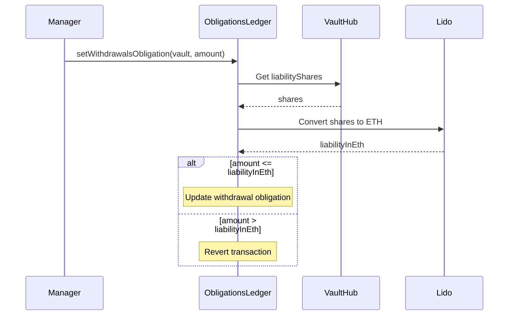
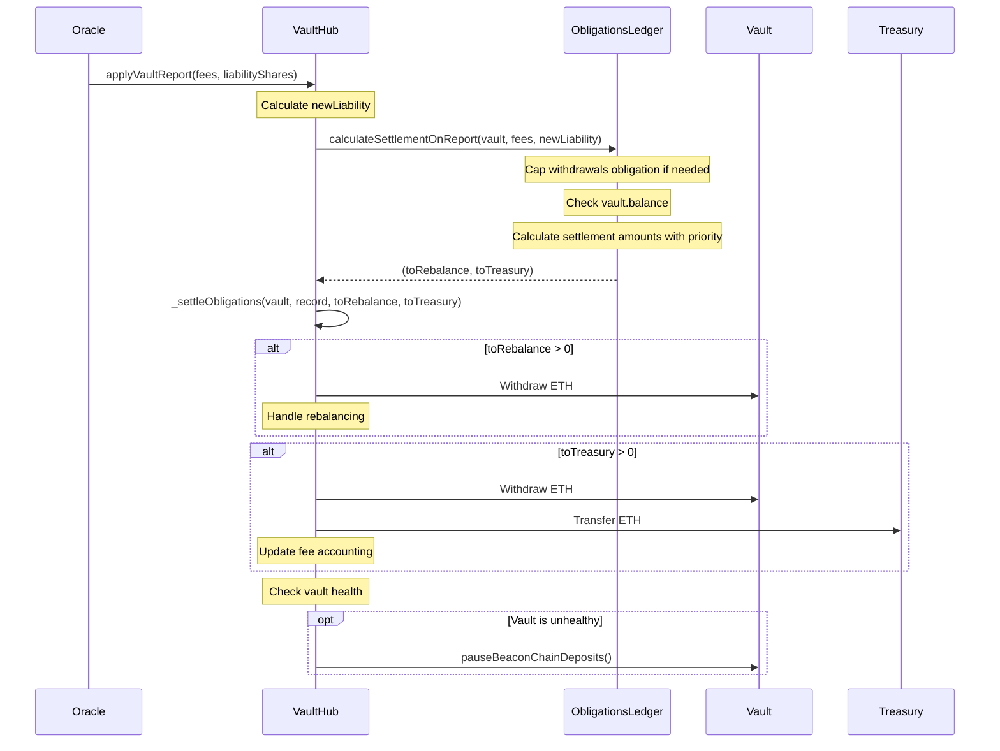
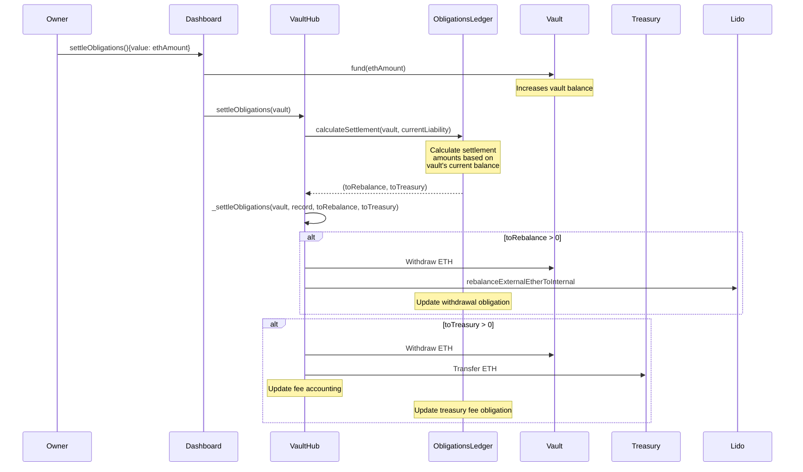
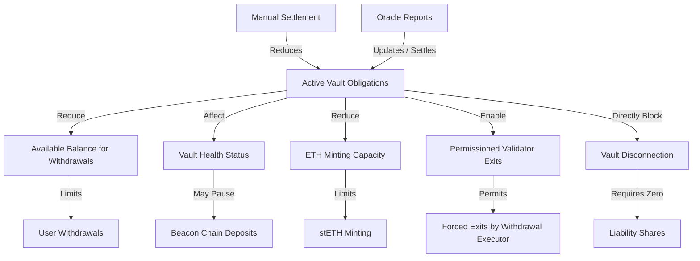
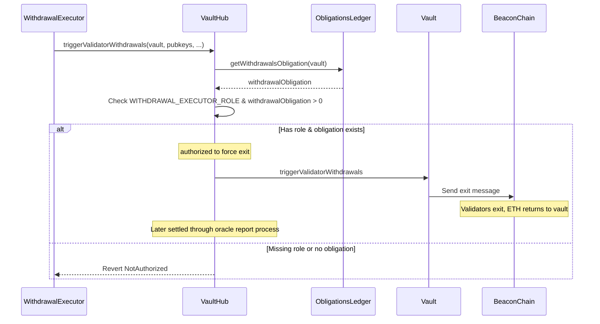

# Lido Vaults: Obligation Flows

This document outlines the core obligation management flows within the Lido Vaults system, highlighting the key interactions and decision points that are essential for understanding the system, building integration tests, and identifying potential edge cases.

---

## 1. Withdrawal Obligation Update

**Flow Purpose:** Manually update a vault's withdrawal obligation by an authorized manager.

**Key Decision Points & Edge Cases:**

1. **Liability Validation**: Withdrawal obligation cannot exceed the vault's current ETH liability
2. **Authorization**: Only accounts with `WITHDRAWAL_MANAGER_ROLE` can update obligations
3. **Liability Dependency**: Changes in shares/ETH rate affect the maximum settable obligation

**Integration Testing Scenarios:**

- Setting valid withdrawal obligation (within liability)
- Attempting to set excessive obligation (exceeding liability)
- Testing with different liability values (affected by share price)
- Testing with unauthorized account

---

## 2. Oracle Report Processing & Obligation Settlement

**Flow Purpose:** Process oracle reports and settle vault obligations based on available ETH balance.

**Key Decision Points & Edge Cases:**

1. **Withdrawal Obligation Capping**: If oracle-reported liability < current withdrawal obligation, the obligation is reduced
2. **Balance-Based Settlement**: Settlement amounts are limited by the vault's ETH balance
3. **Prioritization**: Withdrawal obligations are settled before treasury fees
4. **Partial Settlement**: When balance is insufficient, obligations remain in the ledger for future settlement
5. **Health Check**: Unhealthy vaults have deposits paused automatically

**Integration Testing Scenarios:**

- Oracle report with sufficient vault balance
- Oracle report with insufficient balance for all obligations
- Oracle report with reduced liability (obligation capping)
- Oracle report leading to unhealthy vault

---

## 3. Manual Obligation Settlement

**Flow Purpose:** Allow vault owners to manually trigger obligation settlement without waiting for an oracle report.

**Key Decision Points & Edge Cases:**

1. **Settlement Process**: Uses the same core settlement logic as oracle reports
2. **Available Balance**: Settlement is limited by the vault's ETH balance at the time of settlement
3. **Optional Funding**: The vault can be funded with additional ETH in the same transaction
4. **Prioritization**: Follows the same priority order - withdrawal obligations settled before treasury fees
5. **Partial Settlement**: When balance is insufficient, remaining obligations stay in the ledger

**Integration Testing Scenarios:**

- Manual settlement with and without funding
- Settlement with sufficient balance for all obligations
- Settlement with partial balance (testing prioritization)
- Multiple settlements to gradually clear large obligations

---

## 4. Impact of Obligations on System Functions

**Flow Purpose:** Illustrate how obligations affect other key system operations beyond settlement.

**Key Impacts:**

1. **Available Balance Calculation**:

   - Obligations are subtracted from vault balance to determine available ETH
   - User withdrawals will revert if they exceed this available balance
   - Formula: `available = vaultBalance > obligations ? vaultBalance - obligations : 0`

2. **Minting Capacity**:

   - Obligations reduce mintable value, affecting the vault's ability to mint stETH
   - Formula: `mintableValue = totalValue - (nodeOperatorFee + obligations)`

3. **Vault Health**:

   - Large obligations can affect vault health calculations (liability/collateral ratio)
   - Unhealthy vaults have deposits automatically paused

4. **Validator Exit Authorization**:

   - Withdrawal executor role can force validator exits when withdrawal obligations exist
   - Special case: `canEject = hasRole(WITHDRAWAL_EXECUTOR_ROLE) && _ledger().getWithdrawalsObligation(_vault) > 0`

5. **Vault Disconnection**:
   - Obligations explicitly block vault disconnection through a direct check in the `_initiateDisconnection` function
   - Two requirements must be met for disconnection:
     1. Zero liability shares: `if (liabilityShares_ > 0) { revert NoLiabilitySharesShouldBeLeft(_vault, liabilityShares_); }`
     2. Zero obligations: `if (totalObligations > 0) { revert OutstandingObligationsExist(_vault, totalObligations); }`
   - After passing checks, the process has two phases:
     1. Initiation: The vault is marked as `pendingDisconnect = true`
     2. Completion: During the next oracle report, the vault's ownership is transferred back to its owner, and all records are deleted
   - Using manual settlement is recommended before attempting disconnection

**Integration Testing Scenarios:**

- Attempting withdrawals with various obligation levels
- Testing minting with outstanding obligations
- Checking deposit status after obligations affect health
- Testing validator exit authorization with/without obligations
- Testing vault disconnection with various obligation states

---

## 5. Validator Exit for Obligations

**Flow Purpose:** Show how withdrawal obligations enable special validator exits.

**Key Decision Points & Edge Cases:**

1. **Dual Requirements**: Both role and active withdrawal obligations are required
2. **Balance Return**: Exited validators return ETH to vault, helping fulfill obligations
3. **Settlement Delay**: Returned funds from exits still need oracle report to settle obligations
4. **Partial Withdrawals**: Health check prohibits partial validator withdrawals for unhealthy vaults

**Integration Testing Scenarios:**

- Testing validator exit with and without withdrawal obligations
- Testing with different role combinations
- Testing validator exit impact on obligation settlement
- Testing the restriction on partial withdrawals for unhealthy vaults

---

## System Constraints & Dependencies

1. **Oracle Dependency**: Automatic settlement relies on accurate and timely oracle reports, though manual settlement is available
2. **Balance Dependency**: Settlements are limited by vault ETH balance at execution time
3. **Role-Based Access**: Key functions require specific roles
4. **Order Sensitivity**: The sequence of updates and settlements affects outcomes

---

## Key Failure Modes

1. **Insufficient Balance**: Obligations remain unsettled when vault lacks ETH
2. **Authorization Failures**: Without proper roles, obligation updates will revert
3. **Liability Breaches**: Attempts to set obligations exceeding liability will fail
4. **Stale/Invalid Oracle Data**: Can lead to incorrect settlements
5. **Unhealthy Vaults**: May have restricted functionality (e.g., paused deposits)

---

The system is designed to handle these edge cases gracefully, ensuring that obligations are tracked consistently even when they cannot be immediately settled in full. The architecture employs a robust separation of concerns with the refactored settlement logic:

1. **Calculation vs. Execution**: Settlement logic is divided into calculation (`calculateSettlement`, `calculateSettlementOnReport`) and execution (`_settleObligations`) phases
2. **Reusable Components**: The same core settlement logic is used for both oracle-driven and manual settlements
3. **User Control**: Vault owners can proactively manage obligations through the `settleObligations` function without waiting for oracle reports
4. **Progressive Settlement**: The system allows for partial settlements, handling cases where a vault's balance is insufficient to cover all obligations

This approach provides flexibility while maintaining the integrity of the protocol's financial accounting.
