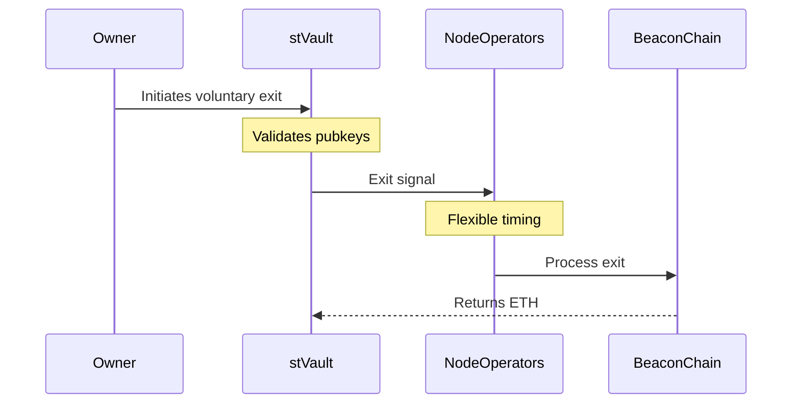
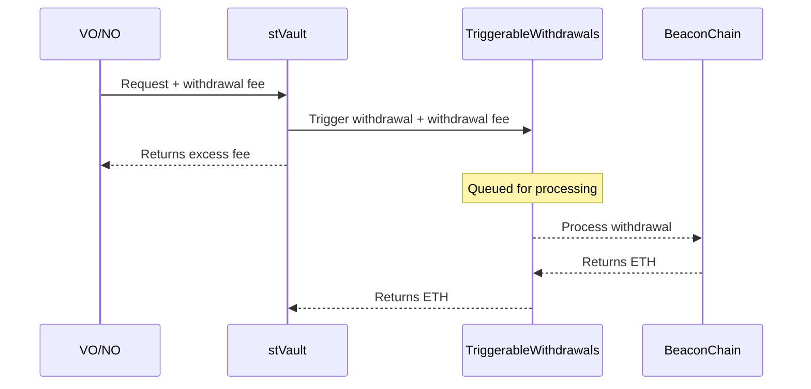
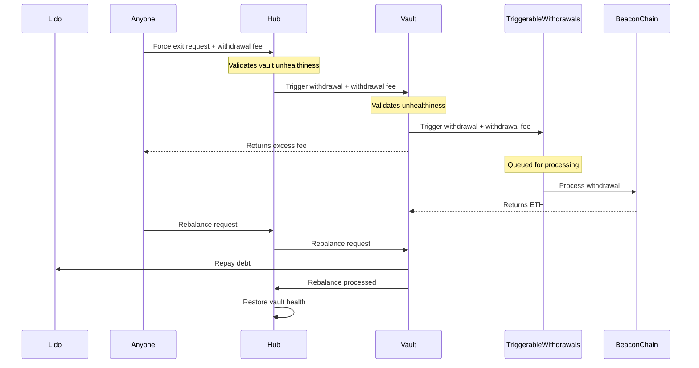

# stVault Validator Exit Flows

## Abstract

stVaults enable three validator exit mechanisms: voluntary exits for planned operations, request-based exits using EIP-7002, and force exits for vault rebalancing. Each mechanism serves a specific purpose in maintaining vault operations and protocol health. The stVault contract plays a crucial role in the broader protocol by ensuring efficient validator management and maintaining the health of the vaults.

## Terminology

- **stVault (Vault)**: The smart contract managing the vault operations.
- **Vault Owner (VO)**: The owner of the stVault contract.
- **Node Operators (NO)**: Entities responsible for managing the validators.
- **BeaconChain (BC)**: The Ethereum 2.0 beacon chain where validators operate.
- **TriggerableWithdrawals (TW)**: Mechanism for initiating withdrawals using [EIP-7002](https://eips.ethereum.org/EIPS/eip-7002).
- **Vault Hub (Hub)**: Central component for managing vault operations.
- **Lido V2 (Lido)**: Core protocol responsible for maintaining stability of the stETH token.

### Exit Selection Guide

| Scenario            | Recommended Exit | Rationale            |
| ------------------- | ---------------- | -------------------- |
| Planned Maintenance | Voluntary        | Flexible timing      |
| Urgent Withdrawal   | Request-Based    | Guaranteed execution |
| Vault Imbalance     | Force            | Restore health       |

## Voluntary Exit Flow

The vault owner signals to a node operator to initiate a validator exit, which is then processed at a flexible timing. The stVault contract will only emit an exit signal that the node operators will then process at their discretion.

> [!NOTE]
>
> - The stVault contract WILL NOT process the exit itself.
> - Can be triggered ONLY by the owner of the stVault contract.

**Purpose:**

- Planned validator rotations
- Routine maintenance
- Non-urgent exits
- Regular rebalancing

## Request-Based Exit Flow

Both the vault owner and the node operators can trigger validator withdrawals using EIP-7002 Triggerable Withdrawals at any time. This process initiates the withdrawal of ETH from the validators controlled by the stVault contract on the beacon chain. Both full and partial withdrawals are supported. Guaranteed execution is ensured through EIP-7002, along with an immediate fee refund.

> [!NOTE]
>
> - Partial withdrawals are ONLY supported when the vault is in a healthy state.

**Purpose:**

- Guaranteed withdrawals
- Time-sensitive operations
- Partial withdrawals
- Available to owner and operator

## Force Exit Flow

A permissionless mechanism used when a vault becomes imbalanced (meaning the vault valuation is below the locked amount). This flow helps restore the vault's health state and get the value for the vault rebalancing.

> [!NOTE]
>
> - ANYONE can trigger this flow
> - ONLY full withdrawals are supported
> - ONLY available when the vault valuation is below the locked amount

**Purpose:**

- Restore vault health state
- Maintain protocol safety

## External References

- [stVaults Design](https://hackmd.io/@lido/stVaults-design)
- [EIP-7002: Triggerable Withdrawals](https://eips.ethereum.org/EIPS/eip-7002)
