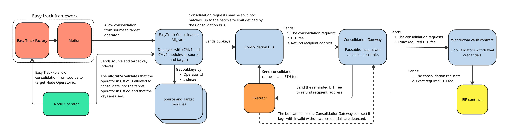
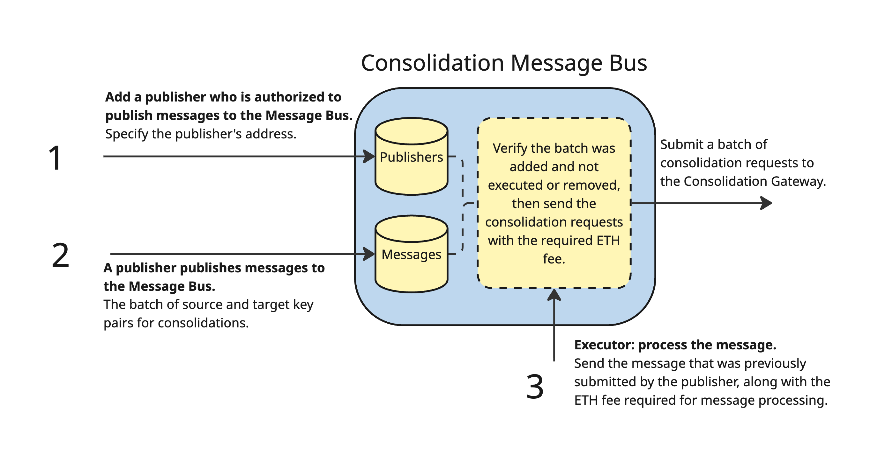

# Staking Router v3.0 scope (Q1-Q2 release)

This document outlines the scope of Staking Router v3.0 (Q1 release) and presents the suggested approaches for each topic.

The release has three main goals:

- Support Max Effective Balance
- Allow node operators consolidate their validators in the new curated module (CMv2)
- Make the necessary preparations for a future operators marketplace

Achieving these goals will require modifications to several parts of the protocol, as well as the addition of new functionality. The overall changes are divided into the following topics:

- **Consolidation**
- **Stake rebalancing**
- **Deposits**
- **Withdrawals**
- **Accounting**

## Consolidation



<details>
<summary>Diagram description: Consolidation Flow Architecture</summary>

The diagram illustrates the complete consolidation flow from initiation to execution:

**Easy Track Framework (left side):**

- **Easy Track Factory** creates a **Motion**
- Easy Track permits consolidation from source to target Node Operator ID
- **Node Operator** sends source and target key indexes to the Consolidation Migrator

**EasyTrack Consolidation Migrator:**

- Deployed with CMv1 and CMv2 modules as source and target
- Validates that the operator in CMv1 is allowed to consolidate into the target operator in CMv2, and that the keys are used
- Retrieves pubkeys by Operator ID and Indexes from **Source and Target modules**
- Sends pubkeys to the Consolidation Bus

**Consolidation Bus:**

- Consolidation requests may be split into batches, up to the batch size limit defined by the Consolidation Bus
- Sends to the Consolidation Gateway: (1) The consolidation requests, (2) ETH fee, (3) Refund recipient address

**Executor (bot):**

- Processes batches from the Consolidation Bus
- Sends the remaining ETH fee to the refund recipient address
- Can pause the ConsolidationGateway contract if keys with invalid withdrawal credentials are detected

**Consolidation Gateway:**

- Pausable contract that encapsulates consolidation limits
- Receives consolidation requests and ETH fee
- Sends to Withdrawal Vault: (1) The consolidation requests, (2) Exact required ETH fee

**Withdrawal Vault contract:**

- Holds Lido validators withdrawal credentials
- Sends to EIP contracts: (1) The consolidation requests, (2) Exact required ETH fee

**EIP contracts:**

- Final destination - the EIP-7251 system contract that processes consolidation requests

</details>

It is suggested that node operators initiate the consolidation process via an EasyTrack motion.

Operators will use EasyTrack to specify source and target operator pairs in CMv1 and CMv2. Once the motion is enacted, stake transfers from a CMv1 operator entity to its corresponding CMv2 entity are permitted, allowing the operator to submit a consolidation request to the Migrator contract.

Once consolidation is allowed, the operator sends the key indexes to the Consolidation Migrator contract, which checks that the keys are in use. The Consolidation Migrator, via dedicated modules, retrieves the pubkeys from the provided key indexes. The consolidation requests are then sent to the Consolidation Bus. After that, the executor bot pays the required ETH fee and executes the requests via the Consolidation Bus.

The Consolidation Bus sends the requests and the required fee to the Consolidation Gateway, which checks the consolidation limits. If the Consolidation Gateway is not paused and the consolidation limit is not reached, it forwards the requests and the required fee to the Withdrawal Vault contract. The Withdrawal Vault then sends the request to the system contract.

Dedicated on-chain monitoring will ensure that operators submit accurate consolidation requests (no attempts to consolidate validators that were requested to exit by VEBO, no consolidation requests for inactive validators, no duplicated pending consolidation requests).

### Consolidation Easy Track

Operators will use EasyTrack to specify source and target operator IDs in CMv1 and CMv2.

Currently, only consolidation from operators in the CMv1 module to operators in the CMv2 module will be allowed. It is proposed that the NOM team will be responsible for reviewing these EasyTrack motions to ensure that operators specify correct pairs of source and target operators in the CMv1 and CMv2 modules, in accordance with the migration plan.

For each pair of operators in CMv1 and CMv2, a dedicated EasyTrack motion must be created. A single node operator in the CMv1 module may consolidate into multiple operators in the CMv2 module.

### Consolidation Migrator

The **Consolidation Migrator** contract validates stake consolidation (migration) requests from a source operator in one module to a target operator in another module.

It ensures that:

- Consolidations are permitted only for explicitly allowed **(sourceOperator → targetOperator)** pairs
- Only validator keys that belong to the specified operators are used
- Each validator key involved in a consolidation is marked as `used`

The **source module ID** and **target module ID** are provided at deployment time in the implementation contract and are immutable thereafter.
Authorized entities can update the allowlist of permitted consolidations.

```solidity
/// @notice Interface for validating and submitting stake consolidation (migration) requests
///         between operators across two modules.
interface IConsolidationMigrator {
  // =========
  //  Events
  // =========
  event ConsolidationPairAllowed(uint256 indexed sourceOperatorId, uint256 indexed targetOperatorId);
  event ConsolidationPairDisallowed(uint256 indexed sourceOperatorId, uint256 indexed targetOperatorId);
  event ConsolidationSubmitted(
    uint256 indexed sourceOperatorId,
    uint256 indexed targetOperatorId,
    uint256[] sourceValidatorIndices,
    uint256[] targetValidatorIndices
  );

  // ==================
  //  Read-only views
  // ==================

  /// @notice Gets the source module ID this migrator is bound to.
  function sourceModuleId() external view returns (uint256);

  /// @notice Gets the target module ID this migrator is bound to.
  function targetModuleId() external view returns (uint256);

  /// @notice Returns true if consolidation from `sourceOperatorId` to `targetOperatorId` is allowed.
  function isPairAllowed(uint256 sourceOperatorId, uint256 targetOperatorId) external view returns (bool);

  /// @notice Returns the list of target operators allowed for a given `sourceOperatorId`.
  function getAllowedTargets(uint256 sourceOperatorId) external view returns (uint256[] memory targetOperatorIds);

  // =========================
  //  Validation & Submission
  // =========================

  /// @notice Validates a batch of consolidation requests without changing state.
  /// @dev Reverts if invalid.
  function validateConsolidationBatch(
    uint256 sourceOperatorId,
    uint256 targetOperatorId,
    uint256[] calldata sourceValidatorIndices,
    uint256[] calldata targetValidatorIndices
  ) external view;

  /// @notice Submits a batch of consolidation requests after validation.
  /// @dev MUST revert if the batch would fail validation. Emits ConsolidationSubmitted on success.
  /// @dev The method may be called either by the source operator’s reward address or by the source operator’s manager address.
  function submitConsolidationBatch(
    uint256 sourceOperatorId,
    uint256 targetOperatorId,
    uint256[] calldata sourceValidatorIndices,
    uint256[] calldata targetValidatorIndices
  ) external;

  // ======================
  //  Allowlist management
  // ======================

  /// @notice Allows consolidations from `sourceOperatorId` to `targetOperatorId`.
  /// @dev Access-controlled in the implementation (role-based).
  function allowPair(uint256 sourceOperatorId, uint256 targetOperatorId) external;

  /// @notice Disallows consolidations from `sourceOperatorId` to `targetOperatorId`.
  /// @dev Access-controlled in the implementation (role-based).
  function disallowPair(uint256 sourceOperatorId, uint256 targetOperatorId) external;
}
```

#### Module Interaction

Since the migrator is a temporary contract whose primary purpose is to support the upcoming stake migration from legacy modules to new modules (specifically from CMv1 to CMv2), it is proposed to rely on the existing key-retrieval methods already implemented by these module types.

```solidity
// Curated v1 and SDVT modules interface
interface ISourceModule {
  function getSigningKey(
    uint256 nodeOperatorId,
    uint256 index
  ) external view returns (bytes key, bytes depositSignature, bool used);
}
```

```solidity
// Curated v2 module interface
interface ITargetModule {
    function getSigningKeys(
        uint256 nodeOperatorId,
        uint256 startIndex,
        uint256 keysCount
    ) external view returns (bytes memory)
}
```

To validate whether a target key has already been used (deposited), the `getNodeOperatorSummary` method from `IStakingModule` will be used to obtain the total number of deposited validators.

```solidity
interface IStakingModule {
  function getNodeOperatorSummary(
    uint256 _nodeOperatorId
  )
    external
    view
    returns (
      uint256 targetLimitMode,
      uint256 targetValidatorsCount,
      uint256 stuckValidatorsCount,
      uint256 refundedValidatorsCount,
      uint256 stuckPenaltyEndTimestamp,
      uint256 totalExitedValidators,
      uint256 totalDepositedValidators,
      uint256 depositableValidatorsCount
    );
}
```

### Consolidation Message Bus

EasyTrack does not support ETH fees. The straightforward design of holding ETH on the contract balance has its limitations:

- Someone could enact EasyTrack when the required fee is extremely high; as a result, a few requests might consume all ETH on the contract balance
- If the contract has an insufficient balance, request execution will fail

The Message Bus solves this problem by decoupling request processing from fee attachment.

`ConsolidationBus` allows authorized actors to submit consolidation requests in batches. It enforces a batch size limit and stores hashes of batches for later processing. An authorized executor processes a batch by submitting it to the `ConsolidationGateway` along with the required fee.



<details>
<summary>Diagram description: Consolidation Message Bus Workflow</summary>

The diagram illustrates the three-step workflow of the Consolidation Message Bus:

**Step 1: Register Publisher**

- Add a publisher who is authorized to publish messages to the Message Bus
- Specify the publisher's address
- The address is stored in the **Publishers** storage

**Step 2: Publish Messages**

- A publisher publishes messages to the Message Bus
- The batch of source and target key pairs for consolidations is submitted
- Messages are stored in the **Messages** storage

**Step 3: Execute Messages**

- **Executor** processes the message
- Sends the message that was previously submitted by the publisher, along with the ETH fee required for message processing
- Verifies the batch was added and not executed or removed
- Sends the consolidation requests with the required ETH fee
- Submits a batch of consolidation requests to the Consolidation Gateway

The Message Bus contains two storage components:

- **Publishers** - registry of authorized publishers
- **Messages** - queue of pending consolidation request batches

</details>

```solidity
/**
 * @title Consolidation Message Bus Interface
 * @notice
 * 1. Admins register/unregister publishers.
 * 2. Registered publishers add consolidation requests.
 * 3. Executor bot execute batches, paying the required ETH fee;
 *    the bus forwards the batch to ConsolidationGateway.
 */
interface IConsolidationBus {
  // Events
  event PublisherRegistered(address publisher);
  event PublisherUnregistered(address publisher);
  event BatchLimitUpdated(uint256 newLimit);
  event RequestsAdded(address publisher, bytes batchData);
  event RequestsExecuted(bytes32 batchHash, uint256 feePaid);

  // Role constants
  // bytes32 public constant MANAGER_ROLE = keccak256("MANAGER_ROLE");
  // bytes32 public constant PUBLISHER_ROLE = keccak256("PUBLISHER_ROLE");
  // bytes32 public constant EXECUTER_ROLE = keccak256("EXECUTER_ROLE");

  // Admin operations (MANAGER_ROLE)
  function registerPublisher(address publisher) external;
  function unregisterPublisher(address publisher) external;
  function setBatchSize(uint256 limit) external;
  function batchSize() external view returns (uint256);
  function removeBatches(bytes32[] calldata batchHashes) external;

  // View methods
  function isBatchAdded(bytes32 batchHash) external view returns (bool);
  function addedBy(bytes32 batchHash) external view returns (address);

  // Publisher API (PUBLISHER_ROLE)
  // 1. Verify caller is a registered publisher.
  // 2. Verify source/target arrays have equal length.
  // 3. Verify batch size does not exceed the limit.
  // 4. Store batch hash and publisher.
  // 5. Emit RequestsAdded event.
  function addConsolidationRequests(bytes[] calldata sourcePubkeys, bytes[] calldata targetPubkeys) external;

  // Executor API (EXECUTER_ROLE)
  // 1. Verify the batch was added and not executed or removed.
  // 2. Forward the batch to the ConsolidationGateway.
  // 3. Mark the batch as executed.
  // 4. Emit RequestsExecuted event.
  function executeConsolidation(bytes[] calldata sourcePubkeys, bytes[] calldata targetPubkeys) external payable;
}
```

#### Executor Bot

It is proposed that only a trusted executor bot be permitted to execute batches of consolidation requests from the message bus queue. The executor bot verifies the withdrawal credentials of both source and target validators, thereby providing an additional layer of protection on top of the on-chain validation performed by the `ConsolidationMigrator` contract.

The executor bot will process consolidation request batches sequentially, in the order in which they were initially submitted to the Consolidation Message Bus contract.

If invalid withdrawal credentials are detected, the Executor Bot will stop executing consolidation batches. An alert will be sent, and the `ConsolidationGateway` contract will be paused via the `GateSeal` mechanism.

### Consolidation Gateway

It is recommended to introduce a single entry point for processing consolidation requests. This entry point would be responsible for enforcing consolidation limits and would allow the consolidation flow to be paused independently in the event of an emergency.

Using the Withdrawal Vault for this purpose is not advisable. The Withdrawal Vault manages multiple independent concerns, including protocol withdrawals and triggerable exit requests. Treating it as a pausable unit would prevent selectively pausing consolidation requests while continuing to accept triggerable withdrawal requests, which is operationally undesirable.

To address this, the `ConsolidationGateway` is introduced as a [pausable contract](https://github.com/lidofinance/core/blob/master/contracts/0.8.9/utils/PausableUntil.sol) designed to handle consolidation requests in a controlled and secure manner. It:

- **Authorizes** only permitted callers to submit requests
- **Enforces request limits** to prevent overload
- **Validates ETH fees**, ensuring they meet minimum consolidation cost
- **Transfers the required fee** to the `WithdrawalVault`
- **Refunds any excess ETH** to a specified recipient
- **Can be paused** via the `GateSeal` mechanism for emergency control

```solidity
interface IConsolidationGateway {
  function addConsolidationRequests(
    bytes[] calldata sourcePubkeys,
    bytes[] calldata targetPubkeys,
    address refundRecipient
  ) external payable onlyRole(ADD_CONSOLIDATION_REQUEST_ROLE) whenResumed;

  function setConsolidationRequestLimit(
    uint256 maxConsolidationRequestsLimit,
    uint256 consolidationsPerFrame,
    uint256 frameDurationInSec
  ) external onlyRole(EXIT_LIMIT_MANAGER_ROLE);

  function getConsolidationRequestLimitFullInfo()
    external
    view
    returns (
      uint256 maxConsolidationRequestsLimit,
      uint256 consolidationsPerFrame,
      uint256 frameDurationInSec,
      uint256 prevConsolidationRequestsLimit,
      uint256 currentConsolidationRequestsLimit
    );

  function resume() external onlyRole(RESUME_ROLE);
  function pauseFor(uint256 duration) external onlyRole(PAUSE_ROLE);
  function pauseUntil(uint256 pauseUntilInclusive) external onlyRole(PAUSE_ROLE);
}
```

### Withdrawal Vault

A consolidation request is made by signing a transaction with the validator's withdrawal address.
Since all Lido core validators use **WithdrawalVault** credentials, the consolidation request to the EIP-7251 system contract must be sent from the **WithdrawalVault** contract.

It is proposed to add the following methods to the WithdrawalVault contract:

- `addConsolidationRequests`
- `getConsolidationRequestFee`

Only the **ConsolidationGateway** contract should be allowed to add consolidation requests.

```solidity
interface IWithdrawalVault {
  /**
   * @dev Submits EIP-7251 consolidation requests for each (source, target) pair.
   *      Each request instructs a validator to consolidate its stake to the target validator.
   *
   * @param sourcePubkeys 48-byte public keys of source validators.
   * @param targetPubkeys 48-byte public keys of target validators.
   *
   * @notice Reverts if:
   *         - Caller is not ConsolidationsGateway.
   *         - Arrays are empty, malformed, or of unequal length.
   *         - Invalid total withdrawal fee value is provided.
   */
  function addConsolidationRequests(bytes[] calldata sourcePubkeys, bytes[] calldata targetPubkeys) external payable;

  /**
   * @dev Returns the current EIP-7251 consolidation fee per request.
   */
  function getConsolidationRequestFee() external view returns (uint256);
}
```
